# Final Project Submission for Mod 4

* Student name: **Andrew Hotchkiss**
* Student pace: **Part time**
* Scheduled project review date/time: 12/23 @ 8pm
* Instructor name: **James Irving**
* Blog post URL: https://stones-1130.github.io/

## TABLE OF CONTENTS 

*Click to jump to matching Markdown Header.

    
- **[Introduction](#INTRODUCTION)<br>**
- **[OBTAIN](#OBTAIN)**<br>
- **[SCRUB](#SCRUB)**<br>
- **[EXPLORE](#EXPLORE)**<br>
- **[MODEL](#MODEL)**<br>
- **[iNTERPRET](#iNTERPRET)**<br>
- **[Conclusions/Recommendations](#CONCLUSIONS-&-RECOMMENDATIONS)<br>**

___

# INTRODUCTION

> **Assignment:**

> What are the top 5 best Zipcodes to invest in?
Forecast median home prices from Zillow data to make recommendations for the top 5 zip codes to invest in in the United States.

**Approach:** 

> - Narrow the forecast to one city/county in the Zillow data set based on background research
> - Turns out to be Boise, Idaho (Ada County)

**Why Boise, ID?**

> - Since 1991, the median home price in Boise has appreciated 391%
> - Highest national average for  year-to-year median increase in home prices (14.4%)
> - #1 in Livability.com 2019 Top 100 Best Places to Live
> - #1 on Forbes 2020 Hottest Housing Markets
Analyzed Zillow and Redfin data on changes in inventory, days on market, and home prices from 2018-2020
> - #1 best housing market in 2020 Realtor.com study
> - #4 best housing market in 2021 Realtor.com study
Home prices expected to rise 10% in 2021


**Criteria for “Best” Zipcode to invest in: 
Lowest risk based on 2-year forecast for median home prices**


# OBTAIN

#### IMPORT LIBRARIES AND PACKAGES


```python
import pandas as pd
import numpy as np
import matplotlib.pyplot as plt
%matplotlib inline
import seaborn as sns
import statsmodels.api as sm

#Project notebook settings
pd.set_option('display.max_columns', 0)

import warnings
warnings.filterwarnings('ignore')

plt.style.use('seaborn-poster')
```


```python
# IMPORT THE DATASET
df = pd.read_csv('zillow_data.csv')
df.head()
```


<table border="1" class="dataframe">
  <thead>
    <tr style="text-align: right;">
      <th></th>
      <th>RegionID</th>
      <th>RegionName</th>
      <th>City</th>
      <th>State</th>
      <th>Metro</th>
      <th>CountyName</th>
      <th>SizeRank</th>
      <th>1996-04</th>
      <th>1996-05</th>
      <th>1996-06</th>
      <th>1996-07</th>
      <th>1996-08</th>
      <th>1996-09</th>
      <th>1996-10</th>
      <th>1996-11</th>
      <th>1996-12</th>
      <th>1997-01</th>
      <th>1997-02</th>
      <th>1997-03</th>
      <th>1997-04</th>
      <th>1997-05</th>
      <th>1997-06</th>
      <th>1997-07</th>
      <th>1997-08</th>
      <th>1997-09</th>
      <th>1997-10</th>
      <th>1997-11</th>
      <th>1997-12</th>
      <th>1998-01</th>
      <th>1998-02</th>
      <th>1998-03</th>
      <th>1998-04</th>
      <th>1998-05</th>
      <th>1998-06</th>
      <th>1998-07</th>
      <th>1998-08</th>
      <th>1998-09</th>
      <th>1998-10</th>
      <th>1998-11</th>
      <th>1998-12</th>
      <th>...</th>
      <th>2015-01</th>
      <th>2015-02</th>
      <th>2015-03</th>
      <th>2015-04</th>
      <th>2015-05</th>
      <th>2015-06</th>
      <th>2015-07</th>
      <th>2015-08</th>
      <th>2015-09</th>
      <th>2015-10</th>
      <th>2015-11</th>
      <th>2015-12</th>
      <th>2016-01</th>
      <th>2016-02</th>
      <th>2016-03</th>
      <th>2016-04</th>
      <th>2016-05</th>
      <th>2016-06</th>
      <th>2016-07</th>
      <th>2016-08</th>
      <th>2016-09</th>
      <th>2016-10</th>
      <th>2016-11</th>
      <th>2016-12</th>
      <th>2017-01</th>
      <th>2017-02</th>
      <th>2017-03</th>
      <th>2017-04</th>
      <th>2017-05</th>
      <th>2017-06</th>
      <th>2017-07</th>
      <th>2017-08</th>
      <th>2017-09</th>
      <th>2017-10</th>
      <th>2017-11</th>
      <th>2017-12</th>
      <th>2018-01</th>
      <th>2018-02</th>
      <th>2018-03</th>
      <th>2018-04</th>
    </tr>
  </thead>
  <tbody>
    <tr>
      <td>0</td>
      <td>84654</td>
      <td>60657</td>
      <td>Chicago</td>
      <td>IL</td>
      <td>Chicago</td>
      <td>Cook</td>
      <td>1</td>
      <td>334200.0</td>
      <td>335400.0</td>
      <td>336500.0</td>
      <td>337600.0</td>
      <td>338500.0</td>
      <td>339500.0</td>
      <td>340400.0</td>
      <td>341300.0</td>
      <td>342600.0</td>
      <td>344400.0</td>
      <td>345700.0</td>
      <td>346700.0</td>
      <td>347800.0</td>
      <td>349000.0</td>
      <td>350400.0</td>
      <td>352000.0</td>
      <td>353900.0</td>
      <td>356200.0</td>
      <td>358800.0</td>
      <td>361800.0</td>
      <td>365700.0</td>
      <td>370200.0</td>
      <td>374700.0</td>
      <td>378900.0</td>
      <td>383500.0</td>
      <td>388300.0</td>
      <td>393300.0</td>
      <td>398500.0</td>
      <td>403800.0</td>
      <td>409100.0</td>
      <td>414600.0</td>
      <td>420100.0</td>
      <td>426200.0</td>
      <td>...</td>
      <td>893000</td>
      <td>895000</td>
      <td>901200</td>
      <td>909400</td>
      <td>915000</td>
      <td>916700</td>
      <td>917700</td>
      <td>919800</td>
      <td>925800</td>
      <td>937100</td>
      <td>948200</td>
      <td>951000</td>
      <td>952500</td>
      <td>958600</td>
      <td>966200</td>
      <td>970400</td>
      <td>973900</td>
      <td>974700</td>
      <td>972600</td>
      <td>974300</td>
      <td>980800</td>
      <td>988000</td>
      <td>994700</td>
      <td>998700</td>
      <td>997000</td>
      <td>993700</td>
      <td>991300</td>
      <td>989200</td>
      <td>991300</td>
      <td>999100</td>
      <td>1005500</td>
      <td>1007500</td>
      <td>1007800</td>
      <td>1009600</td>
      <td>1013300</td>
      <td>1018700</td>
      <td>1024400</td>
      <td>1030700</td>
      <td>1033800</td>
      <td>1030600</td>
    </tr>
    <tr>
      <td>1</td>
      <td>90668</td>
      <td>75070</td>
      <td>McKinney</td>
      <td>TX</td>
      <td>Dallas-Fort Worth</td>
      <td>Collin</td>
      <td>2</td>
      <td>235700.0</td>
      <td>236900.0</td>
      <td>236700.0</td>
      <td>235400.0</td>
      <td>233300.0</td>
      <td>230600.0</td>
      <td>227300.0</td>
      <td>223400.0</td>
      <td>219600.0</td>
      <td>215800.0</td>
      <td>211100.0</td>
      <td>205700.0</td>
      <td>200900.0</td>
      <td>196800.0</td>
      <td>193600.0</td>
      <td>191400.0</td>
      <td>190400.0</td>
      <td>190800.0</td>
      <td>192700.0</td>
      <td>196000.0</td>
      <td>201300.0</td>
      <td>207400.0</td>
      <td>212200.0</td>
      <td>214600.0</td>
      <td>215100.0</td>
      <td>213400.0</td>
      <td>210200.0</td>
      <td>206100.0</td>
      <td>202100.0</td>
      <td>198800.0</td>
      <td>196100.0</td>
      <td>194100.0</td>
      <td>193400.0</td>
      <td>...</td>
      <td>251400</td>
      <td>253000</td>
      <td>255200</td>
      <td>258000</td>
      <td>261200</td>
      <td>264700</td>
      <td>268400</td>
      <td>271400</td>
      <td>273600</td>
      <td>275200</td>
      <td>276400</td>
      <td>277000</td>
      <td>277900</td>
      <td>280000</td>
      <td>282600</td>
      <td>285400</td>
      <td>288400</td>
      <td>290800</td>
      <td>292000</td>
      <td>292800</td>
      <td>293700</td>
      <td>295200</td>
      <td>297000</td>
      <td>299000</td>
      <td>300800</td>
      <td>301800</td>
      <td>302800</td>
      <td>304400</td>
      <td>306200</td>
      <td>307000</td>
      <td>308000</td>
      <td>310000</td>
      <td>312500</td>
      <td>314100</td>
      <td>315000</td>
      <td>316600</td>
      <td>318100</td>
      <td>319600</td>
      <td>321100</td>
      <td>321800</td>
    </tr>
    <tr>
      <td>2</td>
      <td>91982</td>
      <td>77494</td>
      <td>Katy</td>
      <td>TX</td>
      <td>Houston</td>
      <td>Harris</td>
      <td>3</td>
      <td>210400.0</td>
      <td>212200.0</td>
      <td>212200.0</td>
      <td>210700.0</td>
      <td>208300.0</td>
      <td>205500.0</td>
      <td>202500.0</td>
      <td>199800.0</td>
      <td>198300.0</td>
      <td>197300.0</td>
      <td>195400.0</td>
      <td>193000.0</td>
      <td>191800.0</td>
      <td>191800.0</td>
      <td>193000.0</td>
      <td>195200.0</td>
      <td>198400.0</td>
      <td>202800.0</td>
      <td>208000.0</td>
      <td>213800.0</td>
      <td>220700.0</td>
      <td>227500.0</td>
      <td>231800.0</td>
      <td>233400.0</td>
      <td>233900.0</td>
      <td>233500.0</td>
      <td>233300.0</td>
      <td>234300.0</td>
      <td>237400.0</td>
      <td>242800.0</td>
      <td>250200.0</td>
      <td>258600.0</td>
      <td>268000.0</td>
      <td>...</td>
      <td>301700</td>
      <td>302400</td>
      <td>303600</td>
      <td>306200</td>
      <td>309100</td>
      <td>311900</td>
      <td>314100</td>
      <td>316300</td>
      <td>319000</td>
      <td>322000</td>
      <td>324300</td>
      <td>326100</td>
      <td>327300</td>
      <td>327000</td>
      <td>327200</td>
      <td>328500</td>
      <td>329800</td>
      <td>330000</td>
      <td>329000</td>
      <td>327800</td>
      <td>326700</td>
      <td>325500</td>
      <td>324700</td>
      <td>324500</td>
      <td>323700</td>
      <td>322300</td>
      <td>320700</td>
      <td>320000</td>
      <td>320000</td>
      <td>320900</td>
      <td>321000</td>
      <td>320600</td>
      <td>320200</td>
      <td>320400</td>
      <td>320800</td>
      <td>321200</td>
      <td>321200</td>
      <td>323000</td>
      <td>326900</td>
      <td>329900</td>
    </tr>
    <tr>
      <td>3</td>
      <td>84616</td>
      <td>60614</td>
      <td>Chicago</td>
      <td>IL</td>
      <td>Chicago</td>
      <td>Cook</td>
      <td>4</td>
      <td>498100.0</td>
      <td>500900.0</td>
      <td>503100.0</td>
      <td>504600.0</td>
      <td>505500.0</td>
      <td>505700.0</td>
      <td>505300.0</td>
      <td>504200.0</td>
      <td>503600.0</td>
      <td>503400.0</td>
      <td>502200.0</td>
      <td>500000.0</td>
      <td>497900.0</td>
      <td>496300.0</td>
      <td>495200.0</td>
      <td>494700.0</td>
      <td>494900.0</td>
      <td>496200.0</td>
      <td>498600.0</td>
      <td>502000.0</td>
      <td>507600.0</td>
      <td>514900.0</td>
      <td>522200.0</td>
      <td>529500.0</td>
      <td>537900.0</td>
      <td>546900.0</td>
      <td>556400.0</td>
      <td>566100.0</td>
      <td>575600.0</td>
      <td>584800.0</td>
      <td>593500.0</td>
      <td>601600.0</td>
      <td>610100.0</td>
      <td>...</td>
      <td>1176400</td>
      <td>1174600</td>
      <td>1178500</td>
      <td>1185700</td>
      <td>1192900</td>
      <td>1198800</td>
      <td>1200400</td>
      <td>1198900</td>
      <td>1200200</td>
      <td>1207400</td>
      <td>1218600</td>
      <td>1226600</td>
      <td>1230700</td>
      <td>1235400</td>
      <td>1241300</td>
      <td>1245700</td>
      <td>1247000</td>
      <td>1246700</td>
      <td>1245700</td>
      <td>1246000</td>
      <td>1247700</td>
      <td>1252900</td>
      <td>1260900</td>
      <td>1267900</td>
      <td>1272600</td>
      <td>1276600</td>
      <td>1280300</td>
      <td>1282500</td>
      <td>1286000</td>
      <td>1289000</td>
      <td>1289800</td>
      <td>1287700</td>
      <td>1287400</td>
      <td>1291500</td>
      <td>1296600</td>
      <td>1299000</td>
      <td>1302700</td>
      <td>1306400</td>
      <td>1308500</td>
      <td>1307000</td>
    </tr>
    <tr>
      <td>4</td>
      <td>93144</td>
      <td>79936</td>
      <td>El Paso</td>
      <td>TX</td>
      <td>El Paso</td>
      <td>El Paso</td>
      <td>5</td>
      <td>77300.0</td>
      <td>77300.0</td>
      <td>77300.0</td>
      <td>77300.0</td>
      <td>77400.0</td>
      <td>77500.0</td>
      <td>77600.0</td>
      <td>77700.0</td>
      <td>77700.0</td>
      <td>77800.0</td>
      <td>77900.0</td>
      <td>77900.0</td>
      <td>77800.0</td>
      <td>77800.0</td>
      <td>77800.0</td>
      <td>77800.0</td>
      <td>77800.0</td>
      <td>77900.0</td>
      <td>78100.0</td>
      <td>78200.0</td>
      <td>78400.0</td>
      <td>78600.0</td>
      <td>78800.0</td>
      <td>79000.0</td>
      <td>79100.0</td>
      <td>79200.0</td>
      <td>79300.0</td>
      <td>79300.0</td>
      <td>79300.0</td>
      <td>79400.0</td>
      <td>79500.0</td>
      <td>79500.0</td>
      <td>79600.0</td>
      <td>...</td>
      <td>114700</td>
      <td>115000</td>
      <td>115000</td>
      <td>115200</td>
      <td>115600</td>
      <td>115900</td>
      <td>115600</td>
      <td>115400</td>
      <td>115400</td>
      <td>115500</td>
      <td>115800</td>
      <td>116300</td>
      <td>116200</td>
      <td>115600</td>
      <td>115000</td>
      <td>114500</td>
      <td>114200</td>
      <td>114000</td>
      <td>114000</td>
      <td>113900</td>
      <td>114100</td>
      <td>114900</td>
      <td>115700</td>
      <td>116300</td>
      <td>116900</td>
      <td>117300</td>
      <td>117600</td>
      <td>118000</td>
      <td>118600</td>
      <td>118900</td>
      <td>119100</td>
      <td>119400</td>
      <td>120000</td>
      <td>120300</td>
      <td>120300</td>
      <td>120300</td>
      <td>120300</td>
      <td>120500</td>
      <td>121000</td>
      <td>121500</td>
    </tr>
  </tbody>
</table>
<p>5 rows × 272 columns</p>


# EXPLORE


```python
df.shape
```


    (14723, 272)


```python
df.info()
```

    <class 'pandas.core.frame.DataFrame'>
    RangeIndex: 14723 entries, 0 to 14722
    Columns: 272 entries, RegionID to 2018-04
    dtypes: float64(219), int64(49), object(4)
    memory usage: 30.6+ MB


```python
print(df.dtypes)
```

    RegionID       int64
    RegionName     int64
    City          object
    State         object
    Metro         object
                   ...  
    2017-12        int64
    2018-01        int64
    2018-02        int64
    2018-03        int64
    2018-04        int64
    Length: 272, dtype: object


# SCRUB


```python
#DROP COLUMNS WE DON'T NEED
df.drop(['RegionID', 'SizeRank', 'Metro'], axis=1, inplace=True)

df.head()
```


    <tr style="text-align: right;">
      <th></th>
      <th>RegionName</th>
      <th>City</th>
      <th>State</th>
      <th>CountyName</th>
      <th>1996-04</th>
      <th>1996-05</th>
      <th>1996-06</th>
      <th>1996-07</th>
      <th>1996-08</th>
      <th>1996-09</th>
      <th>1996-10</th>
      <th>1996-11</th>
      <th>1996-12</th>
      <th>1997-01</th>
      <th>1997-02</th>
      <th>1997-03</th>
      <th>1997-04</th>
      <th>1997-05</th>
      <th>1997-06</th>
      <th>1997-07</th>
      <th>1997-08</th>
      <th>1997-09</th>
      <th>1997-10</th>
      <th>1997-11</th>
      <th>1997-12</th>
      <th>1998-01</th>
      <th>1998-02</th>
      <th>1998-03</th>
      <th>1998-04</th>
      <th>1998-05</th>
      <th>1998-06</th>
      <th>1998-07</th>
      <th>1998-08</th>
      <th>1998-09</th>
      <th>1998-10</th>
      <th>1998-11</th>
      <th>1998-12</th>
      <th>1999-01</th>
      <th>1999-02</th>
      <th>1999-03</th>
      <th>...</th>
      <th>2015-01</th>
      <th>2015-02</th>
      <th>2015-03</th>
      <th>2015-04</th>
      <th>2015-05</th>
      <th>2015-06</th>
      <th>2015-07</th>
      <th>2015-08</th>
      <th>2015-09</th>
      <th>2015-10</th>
      <th>2015-11</th>
      <th>2015-12</th>
      <th>2016-01</th>
      <th>2016-02</th>
      <th>2016-03</th>
      <th>2016-04</th>
      <th>2016-05</th>
      <th>2016-06</th>
      <th>2016-07</th>
      <th>2016-08</th>
      <th>2016-09</th>
      <th>2016-10</th>
      <th>2016-11</th>
      <th>2016-12</th>
      <th>2017-01</th>
      <th>2017-02</th>
      <th>2017-03</th>
      <th>2017-04</th>
      <th>2017-05</th>
      <th>2017-06</th>
      <th>2017-07</th>
      <th>2017-08</th>
      <th>2017-09</th>
      <th>2017-10</th>
      <th>2017-11</th>
      <th>2017-12</th>
      <th>2018-01</th>
      <th>2018-02</th>
      <th>2018-03</th>
      <th>2018-04</th>
    </tr>
  </thead>
  <tbody>
    <tr>
      <td>0</td>
      <td>60657</td>
      <td>Chicago</td>
      <td>IL</td>
      <td>Cook</td>
      <td>334200.0</td>
      <td>335400.0</td>
      <td>336500.0</td>
      <td>337600.0</td>
      <td>338500.0</td>
      <td>339500.0</td>
      <td>340400.0</td>
      <td>341300.0</td>
      <td>342600.0</td>
      <td>344400.0</td>
      <td>345700.0</td>
      <td>346700.0</td>
      <td>347800.0</td>
      <td>349000.0</td>
      <td>350400.0</td>
      <td>352000.0</td>
      <td>353900.0</td>
      <td>356200.0</td>
      <td>358800.0</td>
      <td>361800.0</td>
      <td>365700.0</td>
      <td>370200.0</td>
      <td>374700.0</td>
      <td>378900.0</td>
      <td>383500.0</td>
      <td>388300.0</td>
      <td>393300.0</td>
      <td>398500.0</td>
      <td>403800.0</td>
      <td>409100.0</td>
      <td>414600.0</td>
      <td>420100.0</td>
      <td>426200.0</td>
      <td>432600.0</td>
      <td>438600.0</td>
      <td>444200.0</td>
      <td>...</td>
      <td>893000</td>
      <td>895000</td>
      <td>901200</td>
      <td>909400</td>
      <td>915000</td>
      <td>916700</td>
      <td>917700</td>
      <td>919800</td>
      <td>925800</td>
      <td>937100</td>
      <td>948200</td>
      <td>951000</td>
      <td>952500</td>
      <td>958600</td>
      <td>966200</td>
      <td>970400</td>
      <td>973900</td>
      <td>974700</td>
      <td>972600</td>
      <td>974300</td>
      <td>980800</td>
      <td>988000</td>
      <td>994700</td>
      <td>998700</td>
      <td>997000</td>
      <td>993700</td>
      <td>991300</td>
      <td>989200</td>
      <td>991300</td>
      <td>999100</td>
      <td>1005500</td>
      <td>1007500</td>
      <td>1007800</td>
      <td>1009600</td>
      <td>1013300</td>
      <td>1018700</td>
      <td>1024400</td>
      <td>1030700</td>
      <td>1033800</td>
      <td>1030600</td>
    </tr>
    <tr>
      <td>1</td>
      <td>75070</td>
      <td>McKinney</td>
      <td>TX</td>
      <td>Collin</td>
      <td>235700.0</td>
      <td>236900.0</td>
      <td>236700.0</td>
      <td>235400.0</td>
      <td>233300.0</td>
      <td>230600.0</td>
      <td>227300.0</td>
      <td>223400.0</td>
      <td>219600.0</td>
      <td>215800.0</td>
      <td>211100.0</td>
      <td>205700.0</td>
      <td>200900.0</td>
      <td>196800.0</td>
      <td>193600.0</td>
      <td>191400.0</td>
      <td>190400.0</td>
      <td>190800.0</td>
      <td>192700.0</td>
      <td>196000.0</td>
      <td>201300.0</td>
      <td>207400.0</td>
      <td>212200.0</td>
      <td>214600.0</td>
      <td>215100.0</td>
      <td>213400.0</td>
      <td>210200.0</td>
      <td>206100.0</td>
      <td>202100.0</td>
      <td>198800.0</td>
      <td>196100.0</td>
      <td>194100.0</td>
      <td>193400.0</td>
      <td>193400.0</td>
      <td>193100.0</td>
      <td>192700.0</td>
      <td>...</td>
      <td>251400</td>
      <td>253000</td>
      <td>255200</td>
      <td>258000</td>
      <td>261200</td>
      <td>264700</td>
      <td>268400</td>
      <td>271400</td>
      <td>273600</td>
      <td>275200</td>
      <td>276400</td>
      <td>277000</td>
      <td>277900</td>
      <td>280000</td>
      <td>282600</td>
      <td>285400</td>
      <td>288400</td>
      <td>290800</td>
      <td>292000</td>
      <td>292800</td>
      <td>293700</td>
      <td>295200</td>
      <td>297000</td>
      <td>299000</td>
      <td>300800</td>
      <td>301800</td>
      <td>302800</td>
      <td>304400</td>
      <td>306200</td>
      <td>307000</td>
      <td>308000</td>
      <td>310000</td>
      <td>312500</td>
      <td>314100</td>
      <td>315000</td>
      <td>316600</td>
      <td>318100</td>
      <td>319600</td>
      <td>321100</td>
      <td>321800</td>
    </tr>
    <tr>
      <td>2</td>
      <td>77494</td>
      <td>Katy</td>
      <td>TX</td>
      <td>Harris</td>
      <td>210400.0</td>
      <td>212200.0</td>
      <td>212200.0</td>
      <td>210700.0</td>
      <td>208300.0</td>
      <td>205500.0</td>
      <td>202500.0</td>
      <td>199800.0</td>
      <td>198300.0</td>
      <td>197300.0</td>
      <td>195400.0</td>
      <td>193000.0</td>
      <td>191800.0</td>
      <td>191800.0</td>
      <td>193000.0</td>
      <td>195200.0</td>
      <td>198400.0</td>
      <td>202800.0</td>
      <td>208000.0</td>
      <td>213800.0</td>
      <td>220700.0</td>
      <td>227500.0</td>
      <td>231800.0</td>
      <td>233400.0</td>
      <td>233900.0</td>
      <td>233500.0</td>
      <td>233300.0</td>
      <td>234300.0</td>
      <td>237400.0</td>
      <td>242800.0</td>
      <td>250200.0</td>
      <td>258600.0</td>
      <td>268000.0</td>
      <td>277000.0</td>
      <td>283600.0</td>
      <td>288500.0</td>
      <td>...</td>
      <td>301700</td>
      <td>302400</td>
      <td>303600</td>
      <td>306200</td>
      <td>309100</td>
      <td>311900</td>
      <td>314100</td>
      <td>316300</td>
      <td>319000</td>
      <td>322000</td>
      <td>324300</td>
      <td>326100</td>
      <td>327300</td>
      <td>327000</td>
      <td>327200</td>
      <td>328500</td>
      <td>329800</td>
      <td>330000</td>
      <td>329000</td>
      <td>327800</td>
      <td>326700</td>
      <td>325500</td>
      <td>324700</td>
      <td>324500</td>
      <td>323700</td>
      <td>322300</td>
      <td>320700</td>
      <td>320000</td>
      <td>320000</td>
      <td>320900</td>
      <td>321000</td>
      <td>320600</td>
      <td>320200</td>
      <td>320400</td>
      <td>320800</td>
      <td>321200</td>
      <td>321200</td>
      <td>323000</td>
      <td>326900</td>
      <td>329900</td>
    </tr>
    <tr>
      <td>3</td>
      <td>60614</td>
      <td>Chicago</td>
      <td>IL</td>
      <td>Cook</td>
      <td>498100.0</td>
      <td>500900.0</td>
      <td>503100.0</td>
      <td>504600.0</td>
      <td>505500.0</td>
      <td>505700.0</td>
      <td>505300.0</td>
      <td>504200.0</td>
      <td>503600.0</td>
      <td>503400.0</td>
      <td>502200.0</td>
      <td>500000.0</td>
      <td>497900.0</td>
      <td>496300.0</td>
      <td>495200.0</td>
      <td>494700.0</td>
      <td>494900.0</td>
      <td>496200.0</td>
      <td>498600.0</td>
      <td>502000.0</td>
      <td>507600.0</td>
      <td>514900.0</td>
      <td>522200.0</td>
      <td>529500.0</td>
      <td>537900.0</td>
      <td>546900.0</td>
      <td>556400.0</td>
      <td>566100.0</td>
      <td>575600.0</td>
      <td>584800.0</td>
      <td>593500.0</td>
      <td>601600.0</td>
      <td>610100.0</td>
      <td>618600.0</td>
      <td>625600.0</td>
      <td>631100.0</td>
      <td>...</td>
      <td>1176400</td>
      <td>1174600</td>
      <td>1178500</td>
      <td>1185700</td>
      <td>1192900</td>
      <td>1198800</td>
      <td>1200400</td>
      <td>1198900</td>
      <td>1200200</td>
      <td>1207400</td>
      <td>1218600</td>
      <td>1226600</td>
      <td>1230700</td>
      <td>1235400</td>
      <td>1241300</td>
      <td>1245700</td>
      <td>1247000</td>
      <td>1246700</td>
      <td>1245700</td>
      <td>1246000</td>
      <td>1247700</td>
      <td>1252900</td>
      <td>1260900</td>
      <td>1267900</td>
      <td>1272600</td>
      <td>1276600</td>
      <td>1280300</td>
      <td>1282500</td>
      <td>1286000</td>
      <td>1289000</td>
      <td>1289800</td>
      <td>1287700</td>
      <td>1287400</td>
      <td>1291500</td>
      <td>1296600</td>
      <td>1299000</td>
      <td>1302700</td>
      <td>1306400</td>
      <td>1308500</td>
      <td>1307000</td>
    </tr>
    <tr>
      <td>4</td>
      <td>79936</td>
      <td>El Paso</td>
      <td>TX</td>
      <td>El Paso</td>
      <td>77300.0</td>
      <td>77300.0</td>
      <td>77300.0</td>
      <td>77300.0</td>
      <td>77400.0</td>
      <td>77500.0</td>
      <td>77600.0</td>
      <td>77700.0</td>
      <td>77700.0</td>
      <td>77800.0</td>
      <td>77900.0</td>
      <td>77900.0</td>
      <td>77800.0</td>
      <td>77800.0</td>
      <td>77800.0</td>
      <td>77800.0</td>
      <td>77800.0</td>
      <td>77900.0</td>
      <td>78100.0</td>
      <td>78200.0</td>
      <td>78400.0</td>
      <td>78600.0</td>
      <td>78800.0</td>
      <td>79000.0</td>
      <td>79100.0</td>
      <td>79200.0</td>
      <td>79300.0</td>
      <td>79300.0</td>
      <td>79300.0</td>
      <td>79400.0</td>
      <td>79500.0</td>
      <td>79500.0</td>
      <td>79600.0</td>
      <td>79700.0</td>
      <td>79900.0</td>
      <td>80100.0</td>
      <td>...</td>
      <td>114700</td>
      <td>115000</td>
      <td>115000</td>
      <td>115200</td>
      <td>115600</td>
      <td>115900</td>
      <td>115600</td>
      <td>115400</td>
      <td>115400</td>
      <td>115500</td>
      <td>115800</td>
      <td>116300</td>
      <td>116200</td>
      <td>115600</td>
      <td>115000</td>
      <td>114500</td>
      <td>114200</td>
      <td>114000</td>
      <td>114000</td>
      <td>113900</td>
      <td>114100</td>
      <td>114900</td>
      <td>115700</td>
      <td>116300</td>
      <td>116900</td>
      <td>117300</td>
      <td>117600</td>
      <td>118000</td>
      <td>118600</td>
      <td>118900</td>
      <td>119100</td>
      <td>119400</td>
      <td>120000</td>
      <td>120300</td>
      <td>120300</td>
      <td>120300</td>
      <td>120300</td>
      <td>120500</td>
      <td>121000</td>
      <td>121500</td>
    </tr>
  </tbody>
</table>
<p>5 rows × 269 columns</p>


```python
#JUST LOOK AT ZIPCODES IN ADA COUNTY (BOISE, ID)
df1 = df.loc[df['CountyName'] == 'Ada'] 

df1
```


<table border="1" class="dataframe">
  <thead>
    <tr style="text-align: right;">
      <th></th>
      <th>RegionName</th>
      <th>City</th>
      <th>State</th>
      <th>CountyName</th>
      <th>1996-04</th>
      <th>1996-05</th>
      <th>1996-06</th>
      <th>1996-07</th>
      <th>1996-08</th>
      <th>1996-09</th>
      <th>1996-10</th>
      <th>1996-11</th>
      <th>1996-12</th>
      <th>1997-01</th>
      <th>1997-02</th>
      <th>1997-03</th>
      <th>1997-04</th>
      <th>1997-05</th>
      <th>1997-06</th>
      <th>1997-07</th>
      <th>1997-08</th>
      <th>1997-09</th>
      <th>1997-10</th>
      <th>1997-11</th>
      <th>1997-12</th>
      <th>1998-01</th>
      <th>1998-02</th>
      <th>1998-03</th>
      <th>1998-04</th>
      <th>1998-05</th>
      <th>1998-06</th>
      <th>1998-07</th>
      <th>1998-08</th>
      <th>1998-09</th>
      <th>1998-10</th>
      <th>1998-11</th>
      <th>1998-12</th>
      <th>1999-01</th>
      <th>1999-02</th>
      <th>1999-03</th>
      <th>...</th>
      <th>2015-01</th>
      <th>2015-02</th>
      <th>2015-03</th>
      <th>2015-04</th>
      <th>2015-05</th>
      <th>2015-06</th>
      <th>2015-07</th>
      <th>2015-08</th>
      <th>2015-09</th>
      <th>2015-10</th>
      <th>2015-11</th>
      <th>2015-12</th>
      <th>2016-01</th>
      <th>2016-02</th>
      <th>2016-03</th>
      <th>2016-04</th>
      <th>2016-05</th>
      <th>2016-06</th>
      <th>2016-07</th>
      <th>2016-08</th>
      <th>2016-09</th>
      <th>2016-10</th>
      <th>2016-11</th>
      <th>2016-12</th>
      <th>2017-01</th>
      <th>2017-02</th>
      <th>2017-03</th>
      <th>2017-04</th>
      <th>2017-05</th>
      <th>2017-06</th>
      <th>2017-07</th>
      <th>2017-08</th>
      <th>2017-09</th>
      <th>2017-10</th>
      <th>2017-11</th>
      <th>2017-12</th>
      <th>2018-01</th>
      <th>2018-02</th>
      <th>2018-03</th>
      <th>2018-04</th>
    </tr>
  </thead>
  <tbody>
    <tr>
      <td>596</td>
      <td>83709</td>
      <td>Boise</td>
      <td>ID</td>
      <td>Ada</td>
      <td>118900.0</td>
      <td>118800.0</td>
      <td>118700.0</td>
      <td>118500.0</td>
      <td>118400.0</td>
      <td>118300.0</td>
      <td>118400.0</td>
      <td>118700.0</td>
      <td>119200.0</td>
      <td>120100.0</td>
      <td>121400.0</td>
      <td>123100.0</td>
      <td>125000.0</td>
      <td>127200.0</td>
      <td>129300.0</td>
      <td>131200.0</td>
      <td>132800.0</td>
      <td>134200.0</td>
      <td>135200.0</td>
      <td>135900.0</td>
      <td>136400.0</td>
      <td>136600.0</td>
      <td>136700.0</td>
      <td>136600.0</td>
      <td>136300.0</td>
      <td>136000.0</td>
      <td>135600.0</td>
      <td>135200.0</td>
      <td>135000.0</td>
      <td>134800.0</td>
      <td>134800.0</td>
      <td>135000.0</td>
      <td>135300.0</td>
      <td>135600.0</td>
      <td>135900.0</td>
      <td>136100.0</td>
      <td>...</td>
      <td>190600</td>
      <td>192200</td>
      <td>193100</td>
      <td>194200</td>
      <td>196000</td>
      <td>198000</td>
      <td>199500</td>
      <td>200300</td>
      <td>200700</td>
      <td>201700</td>
      <td>203300</td>
      <td>204800</td>
      <td>206200</td>
      <td>207900</td>
      <td>209300</td>
      <td>210800</td>
      <td>212000</td>
      <td>213300</td>
      <td>214300</td>
      <td>214900</td>
      <td>216200</td>
      <td>218100</td>
      <td>219900</td>
      <td>221400</td>
      <td>223400</td>
      <td>225600</td>
      <td>228500</td>
      <td>231900</td>
      <td>235200</td>
      <td>237000</td>
      <td>242200</td>
      <td>251800</td>
      <td>261200</td>
      <td>263500</td>
      <td>261100</td>
      <td>257000</td>
      <td>255200</td>
      <td>255100</td>
      <td>256200</td>
      <td>256600</td>
    </tr>
    <tr>
      <td>1343</td>
      <td>83704</td>
      <td>Boise</td>
      <td>ID</td>
      <td>Ada</td>
      <td>94600.0</td>
      <td>94500.0</td>
      <td>94400.0</td>
      <td>94300.0</td>
      <td>94400.0</td>
      <td>94600.0</td>
      <td>95000.0</td>
      <td>95700.0</td>
      <td>96600.0</td>
      <td>97900.0</td>
      <td>99400.0</td>
      <td>101300.0</td>
      <td>103200.0</td>
      <td>105200.0</td>
      <td>107100.0</td>
      <td>108700.0</td>
      <td>110100.0</td>
      <td>111200.0</td>
      <td>112000.0</td>
      <td>112700.0</td>
      <td>113100.0</td>
      <td>113400.0</td>
      <td>113600.0</td>
      <td>113700.0</td>
      <td>113700.0</td>
      <td>113700.0</td>
      <td>113700.0</td>
      <td>113800.0</td>
      <td>113900.0</td>
      <td>114000.0</td>
      <td>114100.0</td>
      <td>114200.0</td>
      <td>114400.0</td>
      <td>114600.0</td>
      <td>114700.0</td>
      <td>114700.0</td>
      <td>...</td>
      <td>158100</td>
      <td>158500</td>
      <td>159000</td>
      <td>160200</td>
      <td>162100</td>
      <td>164200</td>
      <td>166400</td>
      <td>168500</td>
      <td>169700</td>
      <td>170300</td>
      <td>171200</td>
      <td>172400</td>
      <td>173400</td>
      <td>174200</td>
      <td>174900</td>
      <td>176200</td>
      <td>177300</td>
      <td>178700</td>
      <td>181100</td>
      <td>184100</td>
      <td>186300</td>
      <td>187500</td>
      <td>189000</td>
      <td>190500</td>
      <td>191800</td>
      <td>192900</td>
      <td>194100</td>
      <td>195500</td>
      <td>197200</td>
      <td>199200</td>
      <td>199000</td>
      <td>196400</td>
      <td>196700</td>
      <td>200900</td>
      <td>204900</td>
      <td>206500</td>
      <td>207700</td>
      <td>210200</td>
      <td>213800</td>
      <td>215900</td>
    </tr>
    <tr>
      <td>1783</td>
      <td>83706</td>
      <td>Boise</td>
      <td>ID</td>
      <td>Ada</td>
      <td>114600.0</td>
      <td>114600.0</td>
      <td>114500.0</td>
      <td>114400.0</td>
      <td>114400.0</td>
      <td>114500.0</td>
      <td>114700.0</td>
      <td>115200.0</td>
      <td>115900.0</td>
      <td>116900.0</td>
      <td>118200.0</td>
      <td>119800.0</td>
      <td>121600.0</td>
      <td>123500.0</td>
      <td>125300.0</td>
      <td>127000.0</td>
      <td>128500.0</td>
      <td>129600.0</td>
      <td>130400.0</td>
      <td>131000.0</td>
      <td>131300.0</td>
      <td>131500.0</td>
      <td>131400.0</td>
      <td>131200.0</td>
      <td>130900.0</td>
      <td>130600.0</td>
      <td>130300.0</td>
      <td>130000.0</td>
      <td>129900.0</td>
      <td>129800.0</td>
      <td>129800.0</td>
      <td>129900.0</td>
      <td>130000.0</td>
      <td>130200.0</td>
      <td>130500.0</td>
      <td>130700.0</td>
      <td>...</td>
      <td>190300</td>
      <td>192000</td>
      <td>193600</td>
      <td>195300</td>
      <td>196900</td>
      <td>198600</td>
      <td>200700</td>
      <td>202400</td>
      <td>203000</td>
      <td>203900</td>
      <td>206000</td>
      <td>207500</td>
      <td>208500</td>
      <td>209700</td>
      <td>210800</td>
      <td>212800</td>
      <td>215200</td>
      <td>217500</td>
      <td>220200</td>
      <td>222600</td>
      <td>224200</td>
      <td>225600</td>
      <td>226600</td>
      <td>227500</td>
      <td>229300</td>
      <td>231600</td>
      <td>234300</td>
      <td>237200</td>
      <td>240000</td>
      <td>242100</td>
      <td>245100</td>
      <td>251100</td>
      <td>258700</td>
      <td>262900</td>
      <td>263400</td>
      <td>262500</td>
      <td>262300</td>
      <td>263300</td>
      <td>265700</td>
      <td>267500</td>
    </tr>
    <tr>
      <td>2962</td>
      <td>83705</td>
      <td>Boise</td>
      <td>ID</td>
      <td>Ada</td>
      <td>83000.0</td>
      <td>83000.0</td>
      <td>83000.0</td>
      <td>83000.0</td>
      <td>83200.0</td>
      <td>83400.0</td>
      <td>83800.0</td>
      <td>84400.0</td>
      <td>85300.0</td>
      <td>86300.0</td>
      <td>87700.0</td>
      <td>89200.0</td>
      <td>90900.0</td>
      <td>92500.0</td>
      <td>94000.0</td>
      <td>95400.0</td>
      <td>96500.0</td>
      <td>97400.0</td>
      <td>98100.0</td>
      <td>98600.0</td>
      <td>99000.0</td>
      <td>99200.0</td>
      <td>99300.0</td>
      <td>99400.0</td>
      <td>99400.0</td>
      <td>99400.0</td>
      <td>99400.0</td>
      <td>99400.0</td>
      <td>99500.0</td>
      <td>99600.0</td>
      <td>99600.0</td>
      <td>99700.0</td>
      <td>99900.0</td>
      <td>100000.0</td>
      <td>100200.0</td>
      <td>100400.0</td>
      <td>...</td>
      <td>145300</td>
      <td>146100</td>
      <td>146600</td>
      <td>147500</td>
      <td>148800</td>
      <td>150100</td>
      <td>152200</td>
      <td>154400</td>
      <td>155500</td>
      <td>156500</td>
      <td>158400</td>
      <td>160200</td>
      <td>162100</td>
      <td>164100</td>
      <td>165700</td>
      <td>167600</td>
      <td>169700</td>
      <td>172000</td>
      <td>174100</td>
      <td>175700</td>
      <td>176900</td>
      <td>178700</td>
      <td>180700</td>
      <td>182500</td>
      <td>184100</td>
      <td>185600</td>
      <td>187200</td>
      <td>188500</td>
      <td>190300</td>
      <td>192100</td>
      <td>194500</td>
      <td>199200</td>
      <td>205700</td>
      <td>209800</td>
      <td>210000</td>
      <td>208200</td>
      <td>207400</td>
      <td>208100</td>
      <td>210100</td>
      <td>211800</td>
    </tr>
    <tr>
      <td>3635</td>
      <td>83702</td>
      <td>Boise</td>
      <td>ID</td>
      <td>Ada</td>
      <td>145300.0</td>
      <td>145100.0</td>
      <td>144900.0</td>
      <td>144700.0</td>
      <td>144600.0</td>
      <td>144700.0</td>
      <td>145000.0</td>
      <td>145700.0</td>
      <td>146900.0</td>
      <td>148600.0</td>
      <td>150800.0</td>
      <td>153500.0</td>
      <td>156900.0</td>
      <td>160500.0</td>
      <td>164400.0</td>
      <td>168400.0</td>
      <td>172300.0</td>
      <td>175700.0</td>
      <td>178700.0</td>
      <td>181300.0</td>
      <td>183500.0</td>
      <td>185100.0</td>
      <td>186400.0</td>
      <td>187200.0</td>
      <td>187700.0</td>
      <td>187800.0</td>
      <td>187700.0</td>
      <td>187500.0</td>
      <td>187200.0</td>
      <td>186900.0</td>
      <td>186800.0</td>
      <td>186700.0</td>
      <td>186600.0</td>
      <td>186900.0</td>
      <td>187400.0</td>
      <td>188100.0</td>
      <td>...</td>
      <td>302300</td>
      <td>303100</td>
      <td>305500</td>
      <td>309600</td>
      <td>313200</td>
      <td>314600</td>
      <td>315300</td>
      <td>317800</td>
      <td>321700</td>
      <td>325300</td>
      <td>327400</td>
      <td>327900</td>
      <td>328800</td>
      <td>330000</td>
      <td>331700</td>
      <td>334900</td>
      <td>339100</td>
      <td>343600</td>
      <td>348600</td>
      <td>354200</td>
      <td>359800</td>
      <td>365100</td>
      <td>369800</td>
      <td>374100</td>
      <td>379000</td>
      <td>386700</td>
      <td>393800</td>
      <td>396600</td>
      <td>398300</td>
      <td>400900</td>
      <td>402300</td>
      <td>399000</td>
      <td>392100</td>
      <td>392600</td>
      <td>404100</td>
      <td>416600</td>
      <td>423600</td>
      <td>429300</td>
      <td>436000</td>
      <td>441000</td>
    </tr>
    <tr>
      <td>3649</td>
      <td>83616</td>
      <td>Eagle</td>
      <td>ID</td>
      <td>Ada</td>
      <td>186100.0</td>
      <td>185900.0</td>
      <td>185900.0</td>
      <td>185900.0</td>
      <td>186100.0</td>
      <td>186500.0</td>
      <td>187300.0</td>
      <td>188500.0</td>
      <td>190300.0</td>
      <td>192600.0</td>
      <td>195500.0</td>
      <td>198900.0</td>
      <td>202600.0</td>
      <td>206300.0</td>
      <td>210100.0</td>
      <td>213800.0</td>
      <td>217100.0</td>
      <td>220000.0</td>
      <td>222700.0</td>
      <td>225100.0</td>
      <td>227400.0</td>
      <td>229600.0</td>
      <td>231700.0</td>
      <td>233700.0</td>
      <td>235600.0</td>
      <td>237300.0</td>
      <td>238900.0</td>
      <td>240400.0</td>
      <td>241700.0</td>
      <td>242700.0</td>
      <td>243600.0</td>
      <td>244300.0</td>
      <td>244900.0</td>
      <td>245500.0</td>
      <td>246000.0</td>
      <td>246400.0</td>
      <td>...</td>
      <td>328400</td>
      <td>329200</td>
      <td>329900</td>
      <td>331100</td>
      <td>332900</td>
      <td>334900</td>
      <td>336600</td>
      <td>336400</td>
      <td>335200</td>
      <td>335800</td>
      <td>338800</td>
      <td>342400</td>
      <td>345900</td>
      <td>350200</td>
      <td>355100</td>
      <td>361600</td>
      <td>369600</td>
      <td>377200</td>
      <td>380500</td>
      <td>381000</td>
      <td>382700</td>
      <td>386400</td>
      <td>389900</td>
      <td>393000</td>
      <td>395200</td>
      <td>397500</td>
      <td>400800</td>
      <td>403300</td>
      <td>404700</td>
      <td>403700</td>
      <td>415800</td>
      <td>441000</td>
      <td>460100</td>
      <td>460200</td>
      <td>455600</td>
      <td>449900</td>
      <td>447300</td>
      <td>447400</td>
      <td>450400</td>
      <td>453200</td>
    </tr>
    <tr>
      <td>3819</td>
      <td>83713</td>
      <td>Boise</td>
      <td>ID</td>
      <td>Ada</td>
      <td>115900.0</td>
      <td>115800.0</td>
      <td>115800.0</td>
      <td>115800.0</td>
      <td>116000.0</td>
      <td>116300.0</td>
      <td>116800.0</td>
      <td>117700.0</td>
      <td>118900.0</td>
      <td>120500.0</td>
      <td>122400.0</td>
      <td>124600.0</td>
      <td>126900.0</td>
      <td>129100.0</td>
      <td>131200.0</td>
      <td>133000.0</td>
      <td>134500.0</td>
      <td>135700.0</td>
      <td>136600.0</td>
      <td>137300.0</td>
      <td>137800.0</td>
      <td>138100.0</td>
      <td>138300.0</td>
      <td>138500.0</td>
      <td>138400.0</td>
      <td>138400.0</td>
      <td>138200.0</td>
      <td>138100.0</td>
      <td>137900.0</td>
      <td>137700.0</td>
      <td>137600.0</td>
      <td>137400.0</td>
      <td>137400.0</td>
      <td>137300.0</td>
      <td>137300.0</td>
      <td>137400.0</td>
      <td>...</td>
      <td>189300</td>
      <td>189800</td>
      <td>190700</td>
      <td>192100</td>
      <td>193800</td>
      <td>195100</td>
      <td>196200</td>
      <td>196400</td>
      <td>195900</td>
      <td>196100</td>
      <td>197800</td>
      <td>200300</td>
      <td>202800</td>
      <td>205200</td>
      <td>206800</td>
      <td>208500</td>
      <td>210300</td>
      <td>212500</td>
      <td>214100</td>
      <td>214600</td>
      <td>214800</td>
      <td>216000</td>
      <td>217500</td>
      <td>219000</td>
      <td>220400</td>
      <td>222100</td>
      <td>224400</td>
      <td>226900</td>
      <td>229300</td>
      <td>230600</td>
      <td>235600</td>
      <td>247400</td>
      <td>260800</td>
      <td>264600</td>
      <td>260800</td>
      <td>255300</td>
      <td>252400</td>
      <td>251300</td>
      <td>252100</td>
      <td>252800</td>
    </tr>
    <tr>
      <td>4025</td>
      <td>83714</td>
      <td>Garden City</td>
      <td>ID</td>
      <td>Ada</td>
      <td>120000.0</td>
      <td>119900.0</td>
      <td>119900.0</td>
      <td>119900.0</td>
      <td>119900.0</td>
      <td>120000.0</td>
      <td>120300.0</td>
      <td>120700.0</td>
      <td>121500.0</td>
      <td>122500.0</td>
      <td>123700.0</td>
      <td>125300.0</td>
      <td>127100.0</td>
      <td>129000.0</td>
      <td>130900.0</td>
      <td>132800.0</td>
      <td>134500.0</td>
      <td>136000.0</td>
      <td>137300.0</td>
      <td>138300.0</td>
      <td>139200.0</td>
      <td>139800.0</td>
      <td>140200.0</td>
      <td>140500.0</td>
      <td>140500.0</td>
      <td>140500.0</td>
      <td>140300.0</td>
      <td>140100.0</td>
      <td>139900.0</td>
      <td>139800.0</td>
      <td>139600.0</td>
      <td>139600.0</td>
      <td>139700.0</td>
      <td>139700.0</td>
      <td>139800.0</td>
      <td>139900.0</td>
      <td>...</td>
      <td>197100</td>
      <td>197400</td>
      <td>197700</td>
      <td>198500</td>
      <td>200100</td>
      <td>202600</td>
      <td>205400</td>
      <td>207300</td>
      <td>208000</td>
      <td>208800</td>
      <td>210200</td>
      <td>212000</td>
      <td>213600</td>
      <td>215200</td>
      <td>217100</td>
      <td>220600</td>
      <td>224400</td>
      <td>227800</td>
      <td>230300</td>
      <td>232600</td>
      <td>235100</td>
      <td>238200</td>
      <td>240800</td>
      <td>242800</td>
      <td>244400</td>
      <td>246600</td>
      <td>249000</td>
      <td>250700</td>
      <td>251700</td>
      <td>250800</td>
      <td>255600</td>
      <td>265500</td>
      <td>273100</td>
      <td>273400</td>
      <td>272600</td>
      <td>270500</td>
      <td>269600</td>
      <td>270300</td>
      <td>272900</td>
      <td>274900</td>
    </tr>
    <tr>
      <td>5764</td>
      <td>83703</td>
      <td>Boise</td>
      <td>ID</td>
      <td>Ada</td>
      <td>107500.0</td>
      <td>107500.0</td>
      <td>107500.0</td>
      <td>107500.0</td>
      <td>107600.0</td>
      <td>107800.0</td>
      <td>108200.0</td>
      <td>108700.0</td>
      <td>109300.0</td>
      <td>110200.0</td>
      <td>111300.0</td>
      <td>112500.0</td>
      <td>113800.0</td>
      <td>115200.0</td>
      <td>116600.0</td>
      <td>117900.0</td>
      <td>119100.0</td>
      <td>120100.0</td>
      <td>121000.0</td>
      <td>121800.0</td>
      <td>122400.0</td>
      <td>122900.0</td>
      <td>123300.0</td>
      <td>123600.0</td>
      <td>123700.0</td>
      <td>123800.0</td>
      <td>123900.0</td>
      <td>123900.0</td>
      <td>123900.0</td>
      <td>124000.0</td>
      <td>124100.0</td>
      <td>124200.0</td>
      <td>124400.0</td>
      <td>124600.0</td>
      <td>124900.0</td>
      <td>125000.0</td>
      <td>...</td>
      <td>183500</td>
      <td>183800</td>
      <td>184100</td>
      <td>185200</td>
      <td>186800</td>
      <td>188000</td>
      <td>189800</td>
      <td>191900</td>
      <td>193000</td>
      <td>193100</td>
      <td>193500</td>
      <td>194100</td>
      <td>195300</td>
      <td>196700</td>
      <td>198100</td>
      <td>199400</td>
      <td>201600</td>
      <td>204200</td>
      <td>206800</td>
      <td>209500</td>
      <td>213700</td>
      <td>217500</td>
      <td>220200</td>
      <td>223100</td>
      <td>226700</td>
      <td>229600</td>
      <td>232400</td>
      <td>235500</td>
      <td>239200</td>
      <td>243300</td>
      <td>243800</td>
      <td>240400</td>
      <td>237800</td>
      <td>240000</td>
      <td>244700</td>
      <td>250000</td>
      <td>253500</td>
      <td>256500</td>
      <td>260600</td>
      <td>264200</td>
    </tr>
    <tr>
      <td>5995</td>
      <td>83716</td>
      <td>Boise</td>
      <td>ID</td>
      <td>Ada</td>
      <td>129300.0</td>
      <td>129200.0</td>
      <td>129200.0</td>
      <td>129300.0</td>
      <td>129400.0</td>
      <td>129600.0</td>
      <td>130100.0</td>
      <td>130800.0</td>
      <td>131800.0</td>
      <td>133000.0</td>
      <td>134600.0</td>
      <td>136500.0</td>
      <td>138600.0</td>
      <td>140900.0</td>
      <td>143200.0</td>
      <td>145400.0</td>
      <td>147500.0</td>
      <td>149300.0</td>
      <td>150900.0</td>
      <td>152400.0</td>
      <td>153600.0</td>
      <td>154600.0</td>
      <td>155400.0</td>
      <td>156000.0</td>
      <td>156400.0</td>
      <td>156800.0</td>
      <td>157100.0</td>
      <td>157500.0</td>
      <td>157900.0</td>
      <td>158400.0</td>
      <td>159000.0</td>
      <td>159900.0</td>
      <td>160800.0</td>
      <td>161900.0</td>
      <td>162900.0</td>
      <td>163900.0</td>
      <td>...</td>
      <td>248500</td>
      <td>249100</td>
      <td>250100</td>
      <td>251500</td>
      <td>252900</td>
      <td>254100</td>
      <td>256000</td>
      <td>258600</td>
      <td>260200</td>
      <td>260300</td>
      <td>261200</td>
      <td>263200</td>
      <td>265200</td>
      <td>266600</td>
      <td>268200</td>
      <td>270300</td>
      <td>272500</td>
      <td>273900</td>
      <td>275000</td>
      <td>277000</td>
      <td>279000</td>
      <td>280000</td>
      <td>280600</td>
      <td>282000</td>
      <td>283400</td>
      <td>284600</td>
      <td>286900</td>
      <td>289700</td>
      <td>291400</td>
      <td>294200</td>
      <td>295700</td>
      <td>295900</td>
      <td>298700</td>
      <td>302000</td>
      <td>301100</td>
      <td>299300</td>
      <td>299000</td>
      <td>300000</td>
      <td>303000</td>
      <td>305600</td>
    </tr>
    <tr>
      <td>8621</td>
      <td>83712</td>
      <td>Boise</td>
      <td>ID</td>
      <td>Ada</td>
      <td>160900.0</td>
      <td>162000.0</td>
      <td>163200.0</td>
      <td>164400.0</td>
      <td>165600.0</td>
      <td>166900.0</td>
      <td>168300.0</td>
      <td>169800.0</td>
      <td>171500.0</td>
      <td>173300.0</td>
      <td>175200.0</td>
      <td>177200.0</td>
      <td>179300.0</td>
      <td>181500.0</td>
      <td>183600.0</td>
      <td>185800.0</td>
      <td>187900.0</td>
      <td>189900.0</td>
      <td>191800.0</td>
      <td>193700.0</td>
      <td>195700.0</td>
      <td>197700.0</td>
      <td>199500.0</td>
      <td>201300.0</td>
      <td>202900.0</td>
      <td>204400.0</td>
      <td>205800.0</td>
      <td>206900.0</td>
      <td>208000.0</td>
      <td>208800.0</td>
      <td>209500.0</td>
      <td>210100.0</td>
      <td>210800.0</td>
      <td>211500.0</td>
      <td>212200.0</td>
      <td>212800.0</td>
      <td>...</td>
      <td>317900</td>
      <td>319500</td>
      <td>322100</td>
      <td>324500</td>
      <td>326100</td>
      <td>327400</td>
      <td>328300</td>
      <td>329700</td>
      <td>332600</td>
      <td>335400</td>
      <td>336800</td>
      <td>337100</td>
      <td>338200</td>
      <td>340400</td>
      <td>342800</td>
      <td>345200</td>
      <td>347200</td>
      <td>352000</td>
      <td>359700</td>
      <td>368500</td>
      <td>376800</td>
      <td>383200</td>
      <td>384500</td>
      <td>385600</td>
      <td>388700</td>
      <td>392100</td>
      <td>393800</td>
      <td>395300</td>
      <td>397800</td>
      <td>398600</td>
      <td>403600</td>
      <td>408900</td>
      <td>406500</td>
      <td>402600</td>
      <td>409300</td>
      <td>417900</td>
      <td>424400</td>
      <td>428900</td>
      <td>431800</td>
      <td>433500</td>
    </tr>
  </tbody>
</table>
<p>11 rows × 269 columns</p>


> - **There's two cities in Ada County other than Boise proper- Eagle and Garden City. Let's include them to increase the number of zipcodes in our analysis and get a better sense of median home prices in the entire county.**


```python
#RESET INDEX
df1.reset_index(drop=True, inplace=True)
df1.head()
```


    <tr style="text-align: right;">
      <th></th>
      <th>RegionName</th>
      <th>City</th>
      <th>State</th>
      <th>CountyName</th>
      <th>1996-04</th>
      <th>1996-05</th>
      <th>1996-06</th>
      <th>1996-07</th>
      <th>1996-08</th>
      <th>1996-09</th>
      <th>1996-10</th>
      <th>1996-11</th>
      <th>1996-12</th>
      <th>1997-01</th>
      <th>1997-02</th>
      <th>1997-03</th>
      <th>1997-04</th>
      <th>1997-05</th>
      <th>1997-06</th>
      <th>1997-07</th>
      <th>1997-08</th>
      <th>1997-09</th>
      <th>1997-10</th>
      <th>1997-11</th>
      <th>1997-12</th>
      <th>1998-01</th>
      <th>1998-02</th>
      <th>1998-03</th>
      <th>1998-04</th>
      <th>1998-05</th>
      <th>1998-06</th>
      <th>1998-07</th>
      <th>1998-08</th>
      <th>1998-09</th>
      <th>1998-10</th>
      <th>1998-11</th>
      <th>1998-12</th>
      <th>1999-01</th>
      <th>1999-02</th>
      <th>1999-03</th>
      <th>...</th>
      <th>2015-01</th>
      <th>2015-02</th>
      <th>2015-03</th>
      <th>2015-04</th>
      <th>2015-05</th>
      <th>2015-06</th>
      <th>2015-07</th>
      <th>2015-08</th>
      <th>2015-09</th>
      <th>2015-10</th>
      <th>2015-11</th>
      <th>2015-12</th>
      <th>2016-01</th>
      <th>2016-02</th>
      <th>2016-03</th>
      <th>2016-04</th>
      <th>2016-05</th>
      <th>2016-06</th>
      <th>2016-07</th>
      <th>2016-08</th>
      <th>2016-09</th>
      <th>2016-10</th>
      <th>2016-11</th>
      <th>2016-12</th>
      <th>2017-01</th>
      <th>2017-02</th>
      <th>2017-03</th>
      <th>2017-04</th>
      <th>2017-05</th>
      <th>2017-06</th>
      <th>2017-07</th>
      <th>2017-08</th>
      <th>2017-09</th>
      <th>2017-10</th>
      <th>2017-11</th>
      <th>2017-12</th>
      <th>2018-01</th>
      <th>2018-02</th>
      <th>2018-03</th>
      <th>2018-04</th>
    </tr>
  </thead>
  <tbody>
    <tr>
      <td>0</td>
      <td>83709</td>
      <td>Boise</td>
      <td>ID</td>
      <td>Ada</td>
      <td>118900.0</td>
      <td>118800.0</td>
      <td>118700.0</td>
      <td>118500.0</td>
      <td>118400.0</td>
      <td>118300.0</td>
      <td>118400.0</td>
      <td>118700.0</td>
      <td>119200.0</td>
      <td>120100.0</td>
      <td>121400.0</td>
      <td>123100.0</td>
      <td>125000.0</td>
      <td>127200.0</td>
      <td>129300.0</td>
      <td>131200.0</td>
      <td>132800.0</td>
      <td>134200.0</td>
      <td>135200.0</td>
      <td>135900.0</td>
      <td>136400.0</td>
      <td>136600.0</td>
      <td>136700.0</td>
      <td>136600.0</td>
      <td>136300.0</td>
      <td>136000.0</td>
      <td>135600.0</td>
      <td>135200.0</td>
      <td>135000.0</td>
      <td>134800.0</td>
      <td>134800.0</td>
      <td>135000.0</td>
      <td>135300.0</td>
      <td>135600.0</td>
      <td>135900.0</td>
      <td>136100.0</td>
      <td>...</td>
      <td>190600</td>
      <td>192200</td>
      <td>193100</td>
      <td>194200</td>
      <td>196000</td>
      <td>198000</td>
      <td>199500</td>
      <td>200300</td>
      <td>200700</td>
      <td>201700</td>
      <td>203300</td>
      <td>204800</td>
      <td>206200</td>
      <td>207900</td>
      <td>209300</td>
      <td>210800</td>
      <td>212000</td>
      <td>213300</td>
      <td>214300</td>
      <td>214900</td>
      <td>216200</td>
      <td>218100</td>
      <td>219900</td>
      <td>221400</td>
      <td>223400</td>
      <td>225600</td>
      <td>228500</td>
      <td>231900</td>
      <td>235200</td>
      <td>237000</td>
      <td>242200</td>
      <td>251800</td>
      <td>261200</td>
      <td>263500</td>
      <td>261100</td>
      <td>257000</td>
      <td>255200</td>
      <td>255100</td>
      <td>256200</td>
      <td>256600</td>
    </tr>
    <tr>
      <td>1</td>
      <td>83704</td>
      <td>Boise</td>
      <td>ID</td>
      <td>Ada</td>
      <td>94600.0</td>
      <td>94500.0</td>
      <td>94400.0</td>
      <td>94300.0</td>
      <td>94400.0</td>
      <td>94600.0</td>
      <td>95000.0</td>
      <td>95700.0</td>
      <td>96600.0</td>
      <td>97900.0</td>
      <td>99400.0</td>
      <td>101300.0</td>
      <td>103200.0</td>
      <td>105200.0</td>
      <td>107100.0</td>
      <td>108700.0</td>
      <td>110100.0</td>
      <td>111200.0</td>
      <td>112000.0</td>
      <td>112700.0</td>
      <td>113100.0</td>
      <td>113400.0</td>
      <td>113600.0</td>
      <td>113700.0</td>
      <td>113700.0</td>
      <td>113700.0</td>
      <td>113700.0</td>
      <td>113800.0</td>
      <td>113900.0</td>
      <td>114000.0</td>
      <td>114100.0</td>
      <td>114200.0</td>
      <td>114400.0</td>
      <td>114600.0</td>
      <td>114700.0</td>
      <td>114700.0</td>
      <td>...</td>
      <td>158100</td>
      <td>158500</td>
      <td>159000</td>
      <td>160200</td>
      <td>162100</td>
      <td>164200</td>
      <td>166400</td>
      <td>168500</td>
      <td>169700</td>
      <td>170300</td>
      <td>171200</td>
      <td>172400</td>
      <td>173400</td>
      <td>174200</td>
      <td>174900</td>
      <td>176200</td>
      <td>177300</td>
      <td>178700</td>
      <td>181100</td>
      <td>184100</td>
      <td>186300</td>
      <td>187500</td>
      <td>189000</td>
      <td>190500</td>
      <td>191800</td>
      <td>192900</td>
      <td>194100</td>
      <td>195500</td>
      <td>197200</td>
      <td>199200</td>
      <td>199000</td>
      <td>196400</td>
      <td>196700</td>
      <td>200900</td>
      <td>204900</td>
      <td>206500</td>
      <td>207700</td>
      <td>210200</td>
      <td>213800</td>
      <td>215900</td>
    </tr>
    <tr>
      <td>2</td>
      <td>83706</td>
      <td>Boise</td>
      <td>ID</td>
      <td>Ada</td>
      <td>114600.0</td>
      <td>114600.0</td>
      <td>114500.0</td>
      <td>114400.0</td>
      <td>114400.0</td>
      <td>114500.0</td>
      <td>114700.0</td>
      <td>115200.0</td>
      <td>115900.0</td>
      <td>116900.0</td>
      <td>118200.0</td>
      <td>119800.0</td>
      <td>121600.0</td>
      <td>123500.0</td>
      <td>125300.0</td>
      <td>127000.0</td>
      <td>128500.0</td>
      <td>129600.0</td>
      <td>130400.0</td>
      <td>131000.0</td>
      <td>131300.0</td>
      <td>131500.0</td>
      <td>131400.0</td>
      <td>131200.0</td>
      <td>130900.0</td>
      <td>130600.0</td>
      <td>130300.0</td>
      <td>130000.0</td>
      <td>129900.0</td>
      <td>129800.0</td>
      <td>129800.0</td>
      <td>129900.0</td>
      <td>130000.0</td>
      <td>130200.0</td>
      <td>130500.0</td>
      <td>130700.0</td>
      <td>...</td>
      <td>190300</td>
      <td>192000</td>
      <td>193600</td>
      <td>195300</td>
      <td>196900</td>
      <td>198600</td>
      <td>200700</td>
      <td>202400</td>
      <td>203000</td>
      <td>203900</td>
      <td>206000</td>
      <td>207500</td>
      <td>208500</td>
      <td>209700</td>
      <td>210800</td>
      <td>212800</td>
      <td>215200</td>
      <td>217500</td>
      <td>220200</td>
      <td>222600</td>
      <td>224200</td>
      <td>225600</td>
      <td>226600</td>
      <td>227500</td>
      <td>229300</td>
      <td>231600</td>
      <td>234300</td>
      <td>237200</td>
      <td>240000</td>
      <td>242100</td>
      <td>245100</td>
      <td>251100</td>
      <td>258700</td>
      <td>262900</td>
      <td>263400</td>
      <td>262500</td>
      <td>262300</td>
      <td>263300</td>
      <td>265700</td>
      <td>267500</td>
    </tr>
    <tr>
      <td>3</td>
      <td>83705</td>
      <td>Boise</td>
      <td>ID</td>
      <td>Ada</td>
      <td>83000.0</td>
      <td>83000.0</td>
      <td>83000.0</td>
      <td>83000.0</td>
      <td>83200.0</td>
      <td>83400.0</td>
      <td>83800.0</td>
      <td>84400.0</td>
      <td>85300.0</td>
      <td>86300.0</td>
      <td>87700.0</td>
      <td>89200.0</td>
      <td>90900.0</td>
      <td>92500.0</td>
      <td>94000.0</td>
      <td>95400.0</td>
      <td>96500.0</td>
      <td>97400.0</td>
      <td>98100.0</td>
      <td>98600.0</td>
      <td>99000.0</td>
      <td>99200.0</td>
      <td>99300.0</td>
      <td>99400.0</td>
      <td>99400.0</td>
      <td>99400.0</td>
      <td>99400.0</td>
      <td>99400.0</td>
      <td>99500.0</td>
      <td>99600.0</td>
      <td>99600.0</td>
      <td>99700.0</td>
      <td>99900.0</td>
      <td>100000.0</td>
      <td>100200.0</td>
      <td>100400.0</td>
      <td>...</td>
      <td>145300</td>
      <td>146100</td>
      <td>146600</td>
      <td>147500</td>
      <td>148800</td>
      <td>150100</td>
      <td>152200</td>
      <td>154400</td>
      <td>155500</td>
      <td>156500</td>
      <td>158400</td>
      <td>160200</td>
      <td>162100</td>
      <td>164100</td>
      <td>165700</td>
      <td>167600</td>
      <td>169700</td>
      <td>172000</td>
      <td>174100</td>
      <td>175700</td>
      <td>176900</td>
      <td>178700</td>
      <td>180700</td>
      <td>182500</td>
      <td>184100</td>
      <td>185600</td>
      <td>187200</td>
      <td>188500</td>
      <td>190300</td>
      <td>192100</td>
      <td>194500</td>
      <td>199200</td>
      <td>205700</td>
      <td>209800</td>
      <td>210000</td>
      <td>208200</td>
      <td>207400</td>
      <td>208100</td>
      <td>210100</td>
      <td>211800</td>
    </tr>
    <tr>
      <td>4</td>
      <td>83702</td>
      <td>Boise</td>
      <td>ID</td>
      <td>Ada</td>
      <td>145300.0</td>
      <td>145100.0</td>
      <td>144900.0</td>
      <td>144700.0</td>
      <td>144600.0</td>
      <td>144700.0</td>
      <td>145000.0</td>
      <td>145700.0</td>
      <td>146900.0</td>
      <td>148600.0</td>
      <td>150800.0</td>
      <td>153500.0</td>
      <td>156900.0</td>
      <td>160500.0</td>
      <td>164400.0</td>
      <td>168400.0</td>
      <td>172300.0</td>
      <td>175700.0</td>
      <td>178700.0</td>
      <td>181300.0</td>
      <td>183500.0</td>
      <td>185100.0</td>
      <td>186400.0</td>
      <td>187200.0</td>
      <td>187700.0</td>
      <td>187800.0</td>
      <td>187700.0</td>
      <td>187500.0</td>
      <td>187200.0</td>
      <td>186900.0</td>
      <td>186800.0</td>
      <td>186700.0</td>
      <td>186600.0</td>
      <td>186900.0</td>
      <td>187400.0</td>
      <td>188100.0</td>
      <td>...</td>
      <td>302300</td>
      <td>303100</td>
      <td>305500</td>
      <td>309600</td>
      <td>313200</td>
      <td>314600</td>
      <td>315300</td>
      <td>317800</td>
      <td>321700</td>
      <td>325300</td>
      <td>327400</td>
      <td>327900</td>
      <td>328800</td>
      <td>330000</td>
      <td>331700</td>
      <td>334900</td>
      <td>339100</td>
      <td>343600</td>
      <td>348600</td>
      <td>354200</td>
      <td>359800</td>
      <td>365100</td>
      <td>369800</td>
      <td>374100</td>
      <td>379000</td>
      <td>386700</td>
      <td>393800</td>
      <td>396600</td>
      <td>398300</td>
      <td>400900</td>
      <td>402300</td>
      <td>399000</td>
      <td>392100</td>
      <td>392600</td>
      <td>404100</td>
      <td>416600</td>
      <td>423600</td>
      <td>429300</td>
      <td>436000</td>
      <td>441000</td>
    </tr>
  </tbody>
</table>
<p>5 rows × 269 columns</p>


```python
#DROP UNNECESSARY COLUMNS
df1.drop(['State', 'CountyName', 'City'], axis=1, inplace=True)
```

> **Preprocessing steps required  prepare our data for time series visualization, modeling, and forecasting:** 
> - Convert from wide to long format
> - Convert data type for time series column into pandas *datetime* format
> - Rename columns
> - Reset the dataframe index to the time series column


```python
#MELT DATAFRAME FROM WIDE TO LONG FORMAT
df1 = pd.melt(df1, id_vars='RegionName')
df1.head()
```


  <thead>
    <tr style="text-align: right;">
      <th></th>
      <th>RegionName</th>
      <th>variable</th>
      <th>value</th>
    </tr>
  </thead>
  <tbody>
    <tr>
      <td>0</td>
      <td>83709</td>
      <td>1996-04</td>
      <td>118900.0</td>
    </tr>
    <tr>
      <td>1</td>
      <td>83704</td>
      <td>1996-04</td>
      <td>94600.0</td>
    </tr>
    <tr>
      <td>2</td>
      <td>83706</td>
      <td>1996-04</td>
      <td>114600.0</td>
    </tr>
    <tr>
      <td>3</td>
      <td>83705</td>
      <td>1996-04</td>
      <td>83000.0</td>
    </tr>
    <tr>
      <td>4</td>
      <td>83702</td>
      <td>1996-04</td>
      <td>145300.0</td>
    </tr>
  </tbody>
</table>
</div>


```python
#CHANGE 'variable' COLUMN TO DATATIME FORMAT REQUIRED FOR TIMESERIES VISUALIZATION
df1['date'] = pd.to_datetime(df1['variable'])
df1.drop('variable', inplace=True, axis=1)

#RENAME 'variable' COLUMN TO MEDIAN PRICE
df1.rename(columns = {'value':'median_price'}, inplace = True) 


#SET DATE AS INDEX (REQUIRED FOR VISUALIZING TIMESERIES)
df1.set_index('date', inplace=True)

df1.head()
```


  <thead>
    <tr style="text-align: right;">
      <th></th>
      <th>RegionName</th>
      <th>median_price</th>
    </tr>
    <tr>
      <th>date</th>
      <th></th>
      <th></th>
    </tr>
  </thead>
  <tbody>
    <tr>
      <td>1996-04-01</td>
      <td>83709</td>
      <td>118900.0</td>
    </tr>
    <tr>
      <td>1996-04-01</td>
      <td>83704</td>
      <td>94600.0</td>
    </tr>
    <tr>
      <td>1996-04-01</td>
      <td>83706</td>
      <td>114600.0</td>
    </tr>
    <tr>
      <td>1996-04-01</td>
      <td>83705</td>
      <td>83000.0</td>
    </tr>
    <tr>
      <td>1996-04-01</td>
      <td>83702</td>
      <td>145300.0</td>
    </tr>
  </tbody>
</table>


> **Now that we have our dataframe into the proper format with the time series index, let's create a dictionary of the Ada County zipcodes so that we can easily access them in the future.**


```python
#CHECK FOR NANs
df1.isna().sum()
```


    RegionName      0
    median_price    0
    dtype: int64


```python
#CREATE LIST OF ALL ADA COUNTY ZIPCODES
zipcode_list = list(df1['RegionName'].unique())

#CREATE AN EMPTY DICTIONARY TO STORE THE ADA COUNTY ZIPCODES
zip_data = {}

#POPULATE THE DICTIONARY WITH ZIPCODES AS KEYS AND DATES/PRICES AS VALUES
for zip_1 in zipcode_list: 
    zip_data[zip_1] = df1.loc[df1['RegionName'] == zip_1, 'median_price']
    
zip_data
```


    {83709: date
     1996-04-01    118900.0
     1996-05-01    118800.0
     1996-06-01    118700.0
     1996-07-01    118500.0
     1996-08-01    118400.0
                     ...   
     2017-12-01    257000.0
     2018-01-01    255200.0
     2018-02-01    255100.0
     2018-03-01    256200.0
     2018-04-01    256600.0
     Name: median_price, Length: 265, dtype: float64, 83704: date
     1996-04-01     94600.0
     1996-05-01     94500.0
     1996-06-01     94400.0
     1996-07-01     94300.0
     1996-08-01     94400.0
                     ...   
     2017-12-01    206500.0
     2018-01-01    207700.0
     2018-02-01    210200.0
     2018-03-01    213800.0
     2018-04-01    215900.0
     Name: median_price, Length: 265, dtype: float64, 83706: date
     1996-04-01    114600.0
     1996-05-01    114600.0
     1996-06-01    114500.0
     1996-07-01    114400.0
     1996-08-01    114400.0
                     ...   
     2017-12-01    262500.0
     2018-01-01    262300.0
     2018-02-01    263300.0
     2018-03-01    265700.0
     2018-04-01    267500.0
     Name: median_price, Length: 265, dtype: float64, 83705: date
     1996-04-01     83000.0
     1996-05-01     83000.0
     1996-06-01     83000.0
     1996-07-01     83000.0
     1996-08-01     83200.0
                     ...   
     2017-12-01    208200.0
     2018-01-01    207400.0
     2018-02-01    208100.0
     2018-03-01    210100.0
     2018-04-01    211800.0
     Name: median_price, Length: 265, dtype: float64, 83702: date
     1996-04-01    145300.0
     1996-05-01    145100.0
     1996-06-01    144900.0
     1996-07-01    144700.0
     1996-08-01    144600.0
                     ...   
     2017-12-01    416600.0
     2018-01-01    423600.0
     2018-02-01    429300.0
     2018-03-01    436000.0
     2018-04-01    441000.0
     Name: median_price, Length: 265, dtype: float64, 83616: date
     1996-04-01    186100.0
     1996-05-01    185900.0
     1996-06-01    185900.0
     1996-07-01    185900.0
     1996-08-01    186100.0
                     ...   
     2017-12-01    449900.0
     2018-01-01    447300.0
     2018-02-01    447400.0
     2018-03-01    450400.0
     2018-04-01    453200.0
     Name: median_price, Length: 265, dtype: float64, 83713: date
     1996-04-01    115900.0
     1996-05-01    115800.0
     1996-06-01    115800.0
     1996-07-01    115800.0
     1996-08-01    116000.0
                     ...   
     2017-12-01    255300.0
     2018-01-01    252400.0
     2018-02-01    251300.0
     2018-03-01    252100.0
     2018-04-01    252800.0
     Name: median_price, Length: 265, dtype: float64, 83714: date
     1996-04-01    120000.0
     1996-05-01    119900.0
     1996-06-01    119900.0
     1996-07-01    119900.0
     1996-08-01    119900.0
                     ...   
     2017-12-01    270500.0
     2018-01-01    269600.0
     2018-02-01    270300.0
     2018-03-01    272900.0
     2018-04-01    274900.0
     Name: median_price, Length: 265, dtype: float64, 83703: date
     1996-04-01    107500.0
     1996-05-01    107500.0
     1996-06-01    107500.0
     1996-07-01    107500.0
     1996-08-01    107600.0
                     ...   
     2017-12-01    250000.0
     2018-01-01    253500.0
     2018-02-01    256500.0
     2018-03-01    260600.0
     2018-04-01    264200.0
     Name: median_price, Length: 265, dtype: float64, 83716: date
     1996-04-01    129300.0
     1996-05-01    129200.0
     1996-06-01    129200.0
     1996-07-01    129300.0
     1996-08-01    129400.0
                     ...   
     2017-12-01    299300.0
     2018-01-01    299000.0
     2018-02-01    300000.0
     2018-03-01    303000.0
     2018-04-01    305600.0
     Name: median_price, Length: 265, dtype: float64, 83712: date
     1996-04-01    160900.0
     1996-05-01    162000.0
     1996-06-01    163200.0
     1996-07-01    164400.0
     1996-08-01    165600.0
                     ...   
     2017-12-01    417900.0
     2018-01-01    424400.0
     2018-02-01    428900.0
     2018-03-01    431800.0
     2018-04-01    433500.0
     Name: median_price, Length: 265, dtype: float64}


```python
#TEST PLOT A SINGLE ZIPCODE TO MAKE SURE THE DATA SAVED PROPERLY
zip_data[83709].plot();
plt.xlabel('Date')
plt.ylabel('Median $ price')
plt.title("Zipcode 83709 median sale price 1996-2018")
plt.show()
```


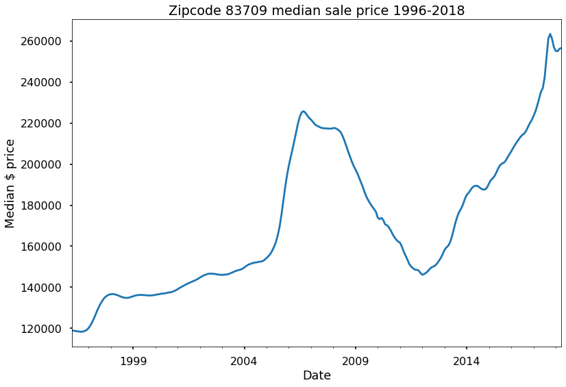


> **Now that we've saved the Ada Country zipcodes into a dictionary, we want to put them back into a dataframe so that we can plot them together to see if any zipcodes stand out from a trend perspective.** 


```python
#TURN THE DICTIONARY INTO A DATAFRAME TO PREPARE FOR VISUALIZATION
df2 = pd.DataFrame(zip_data)
df2.head()
```


    <tr style="text-align: right;">
      <th></th>
      <th>83709</th>
      <th>83704</th>
      <th>83706</th>
      <th>83705</th>
      <th>83702</th>
      <th>83616</th>
      <th>83713</th>
      <th>83714</th>
      <th>83703</th>
      <th>83716</th>
      <th>83712</th>
    </tr>
    <tr>
      <th>date</th>
      <th></th>
      <th></th>
      <th></th>
      <th></th>
      <th></th>
      <th></th>
      <th></th>
      <th></th>
      <th></th>
      <th></th>
      <th></th>
    </tr>
  </thead>
  <tbody>
    <tr>
      <td>1996-04-01</td>
      <td>118900.0</td>
      <td>94600.0</td>
      <td>114600.0</td>
      <td>83000.0</td>
      <td>145300.0</td>
      <td>186100.0</td>
      <td>115900.0</td>
      <td>120000.0</td>
      <td>107500.0</td>
      <td>129300.0</td>
      <td>160900.0</td>
    </tr>
    <tr>
      <td>1996-05-01</td>
      <td>118800.0</td>
      <td>94500.0</td>
      <td>114600.0</td>
      <td>83000.0</td>
      <td>145100.0</td>
      <td>185900.0</td>
      <td>115800.0</td>
      <td>119900.0</td>
      <td>107500.0</td>
      <td>129200.0</td>
      <td>162000.0</td>
    </tr>
    <tr>
      <td>1996-06-01</td>
      <td>118700.0</td>
      <td>94400.0</td>
      <td>114500.0</td>
      <td>83000.0</td>
      <td>144900.0</td>
      <td>185900.0</td>
      <td>115800.0</td>
      <td>119900.0</td>
      <td>107500.0</td>
      <td>129200.0</td>
      <td>163200.0</td>
    </tr>
    <tr>
      <td>1996-07-01</td>
      <td>118500.0</td>
      <td>94300.0</td>
      <td>114400.0</td>
      <td>83000.0</td>
      <td>144700.0</td>
      <td>185900.0</td>
      <td>115800.0</td>
      <td>119900.0</td>
      <td>107500.0</td>
      <td>129300.0</td>
      <td>164400.0</td>
    </tr>
    <tr>
      <td>1996-08-01</td>
      <td>118400.0</td>
      <td>94400.0</td>
      <td>114400.0</td>
      <td>83200.0</td>
      <td>144600.0</td>
      <td>186100.0</td>
      <td>116000.0</td>
      <td>119900.0</td>
      <td>107600.0</td>
      <td>129400.0</td>
      <td>165600.0</td>
    </tr>
  </tbody>
</table>


> **Let's only use housing data starting from 2013. Inflation and other historical market events (i.e. the crash in 2008) since the beginning of the data set could skew our models and our forecasts.**

> **Reaching back at least 5 years into the data (2013) ensures that we're able to make forecasts at least another 5 years into the future (2023)- which is as far as we want to go anyway.**


```python
#TRIM DATA TO ONLY INCLUDE HOUSING PRICES FROM 2013-2018

df2 = df2.loc['2013-01-01':, :]

df2.head()
```


    <tr style="text-align: right;">
      <th></th>
      <th>83709</th>
      <th>83704</th>
      <th>83706</th>
      <th>83705</th>
      <th>83702</th>
      <th>83616</th>
      <th>83713</th>
      <th>83714</th>
      <th>83703</th>
      <th>83716</th>
      <th>83712</th>
    </tr>
    <tr>
      <th>date</th>
      <th></th>
      <th></th>
      <th></th>
      <th></th>
      <th></th>
      <th></th>
      <th></th>
      <th></th>
      <th></th>
      <th></th>
      <th></th>
    </tr>
  </thead>
  <tbody>
    <tr>
      <td>2013-01-01</td>
      <td>158200.0</td>
      <td>134800.0</td>
      <td>160000.0</td>
      <td>124600.0</td>
      <td>263100.0</td>
      <td>298900.0</td>
      <td>159200.0</td>
      <td>167700.0</td>
      <td>150800.0</td>
      <td>216300.0</td>
      <td>284800.0</td>
    </tr>
    <tr>
      <td>2013-02-01</td>
      <td>159400.0</td>
      <td>135200.0</td>
      <td>161000.0</td>
      <td>125300.0</td>
      <td>263300.0</td>
      <td>302300.0</td>
      <td>159800.0</td>
      <td>168100.0</td>
      <td>151500.0</td>
      <td>217900.0</td>
      <td>285300.0</td>
    </tr>
    <tr>
      <td>2013-03-01</td>
      <td>160200.0</td>
      <td>136300.0</td>
      <td>163300.0</td>
      <td>126700.0</td>
      <td>263600.0</td>
      <td>305200.0</td>
      <td>161700.0</td>
      <td>169400.0</td>
      <td>152900.0</td>
      <td>219700.0</td>
      <td>287300.0</td>
    </tr>
    <tr>
      <td>2013-04-01</td>
      <td>161900.0</td>
      <td>138100.0</td>
      <td>166400.0</td>
      <td>128700.0</td>
      <td>265500.0</td>
      <td>308200.0</td>
      <td>165200.0</td>
      <td>172900.0</td>
      <td>155800.0</td>
      <td>221600.0</td>
      <td>291500.0</td>
    </tr>
    <tr>
      <td>2013-05-01</td>
      <td>164700.0</td>
      <td>140100.0</td>
      <td>170200.0</td>
      <td>130300.0</td>
      <td>269200.0</td>
      <td>311400.0</td>
      <td>168500.0</td>
      <td>177300.0</td>
      <td>158700.0</td>
      <td>225300.0</td>
      <td>296600.0</td>
    </tr>
  </tbody>
</table>


```python
#PLOT ALL THE ZIPCODES ON ONE GRAPH TO LOOK FOR MACRO TRENDS/ANOMALIES
df2.plot(legend=True, figsize = (22,12))
plt.xlabel('Date')
plt.ylabel('Median $ price')
plt.title("Ada County Zipcodes median sale prices 1996-2018")
plt.show()
```


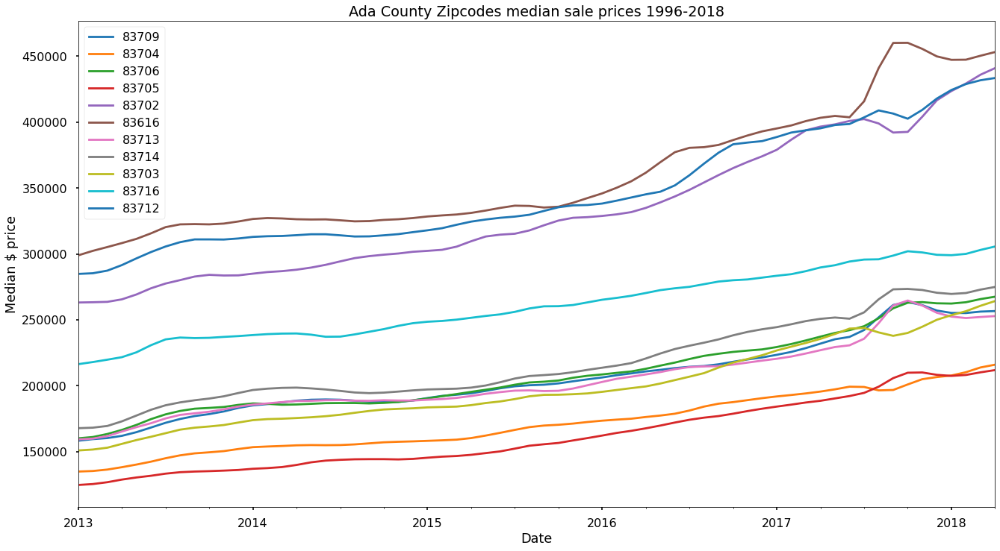


> **Our time series data are non-stationary and have a positive trend.**

> **We will need to address this before modeling our data, but first let's decompose the time series for one zipcode to get a better understanding of our non-stationary data set.**


```python
#IMPORT STATSMODELS TOOLS TO ANALYIZE TIME SERIES DATA

from statsmodels.tsa.seasonal import seasonal_decompose
from statsmodels.graphics.tsaplots import plot_acf, plot_pacf
from pandas.plotting import autocorrelation_plot, lag_plot
import matplotlib as mpl
```


```python
#TAKE A LOOK AT TREND, SEASONALITY, AND RESIDUALS FOR ONE ZIPCODE

zipcode = 83616
ts = df2[zipcode].copy()
ts_result = seasonal_decompose(ts, model='additive')
ts_result.plot();

```


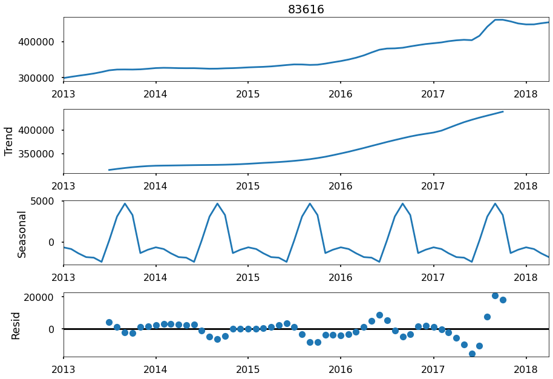


> **We clearly have a positive trend and seasonal component to our median housing prices that we'll need to take into account in our modeling and forecasting.**

> - **To deal with the trend and seasonality, we'll use auto_arima to select the right p, q, and d parameters to give us the best model.** 

# MODEL

> **As with all machine learning modeling, we'll need to split our data into training and test sets. With time series, it can be helpful to visualize the train-test split using the below visualization.**


```python
# TRAIN TEST SPLIT INDEX
#CODE ADAPTED FROM JAMES' LECTURE NOTES

train_size = 0.8
split_idx = round(len(ts) * train_size)

# SPLIT
train = ts.iloc[:split_idx]
test = ts.iloc[split_idx:]

#VISUALIZE TRAIN TEST SPLIT
fig, ax = plt.subplots()
kws = dict(ax=ax,marker='o')
train.plot(**kws)
test.plot(**kws)
plt.xlabel('Date')
plt.ylabel('Median $ price')
plt.title("Zipcode 83616 // train=blue, test=orange")
ax.legend(bbox_to_anchor=[1,1]);
```


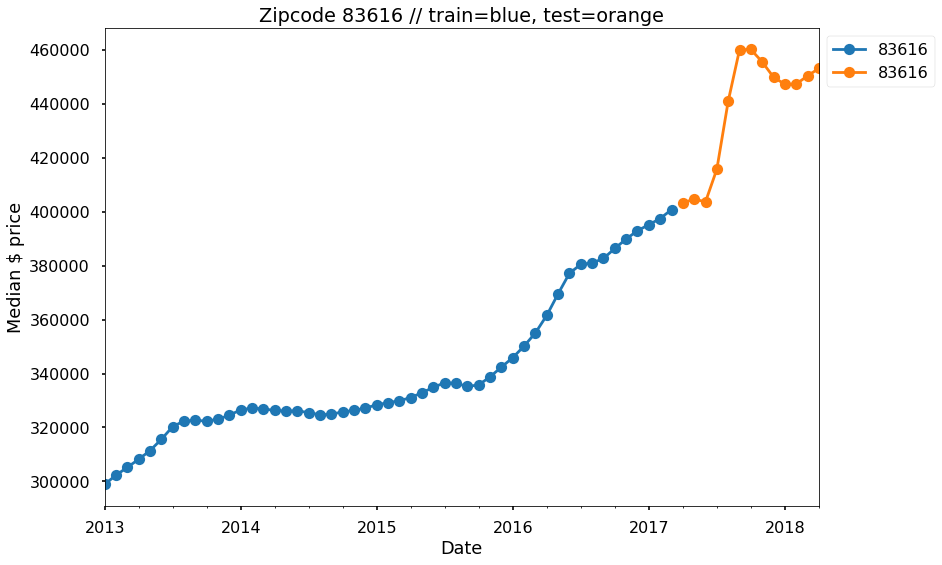


> - **The blue dots indicate our training data and the orange dots indicate test data.**

> **Now let's build a function to plot our prediction results along side our training and test data. This will give us perspective on how our predictions and forecasts compare to the rest of our data.**


```python
#CODE ADAPTED FROM JAMES' LECTURE NOTES

def plot_train_test_pred(train, test, pred_df):
    '''Function to plot prediction results'''
    
    fig, ax = plt.subplots()
    kws = dict(marker='o')
    
    ax.plot(train, label='Train', **kws)
    ax.plot(test, label='Test', **kws)
    ax.plot(pred_df['prediction'], label='Prediction', ls='--', **kws)
    ax.set(ylabel="Median price - $ USD", xlabel='Date')
    
    ax.fill_between(x=pred_df.index, y1=pred_df['lower'], y2=pred_df['upper'])
    ax.legend(bbox_to_anchor=[1,1])
    fig.tight_layout()
    return fig,ax
```

> - **Now we'll use auto_arima for parameter selection.**
> - **auto_arima is essentially a grid search to determine the best parameters p, d, and q to deal with the positive trend and seasonality in our non-stationary time series data.**


```python
#IMPORT auto_arima AND SARIMAX LIBRARIES
from pmdarima.arima import auto_arima
from statsmodels.tsa.statespace.sarimax import SARIMAX
from sklearn import metrics

```


```python
#CODE ADAPTED FROM JAMES' LECTURE NOTES

def forecast_to_df(forecast, zipcode):
    '''Function to forecast prices and store them in a dataframe'''
    
    test_pred = forecast.conf_int()
    test_pred[zipcode] = forecast.predicted_mean
    test_pred.columns = ['lower', 'upper', 'prediction']
    return test_pred

```

> **Now let's put all of our tools together and use dynamic forecasting to predict the median home prices for all zipcodes in Ada County from May 2018 - April 2020.**

> **Using these predictions, we'll be able to determine which zipcodes have the lowest risk and are therefore the best investment.**


```python
#USE DYNAMIC FORCASTING TO PREDICT HOUSE PRICES 2 YEARS INTO THE FUTURE
#CODE ADAPTED FROM JAMES' LECTURE NOTES

#CREATE AN EMPTY DICTIONARY TO STORE THE MODELING RESULTS
RESULTS = {}

for zipcode in zipcode_list:
    '''Forecast mean home values for each zipcode in Ada County, Idaho'''
    
    print("ZIPCODE: ", zipcode)

    # MAKE EMPTY DICTIONARY FOR ZIPCODE DATA
    zipcode_z = {}

    # COPY TIME SERIES DATAFRAME
    ts = df2[zipcode].copy()

    # TRAIN TEST SPLIT INDEX
    train_size = 0.85
    split_idx = round(len(ts) * train_size)
    split_idx

    # SPLIT
    train = ts.iloc[:split_idx]
    test = ts.iloc[split_idx:]

    # GET BEST PARAMS USING AUTO ARIMA
    gs_model = auto_arima(train, start_p=0, start_q=0)
    
    #MODEL USING SARIMAX
    best_model = SARIMAX(ts, order=gs_model.order, 
                         seasonal_order=gs_model.seasonal_order).fit()

    # GET PREDICTIONS FOR 2 YEARS IN ADVANCE (2018-2020)
    ##DATA IS SAMPLED MONTHLY - 12x2 = 24 MONTHS (steps)
    pred = best_model.get_forecast(steps=24)
    pred_df = forecast_to_df(pred, zipcode)

  
    # SAVE INFO TO DICTIONARY
    zipcode_z['pred_df'] = pred_df
    zipcode_z['model'] = best_model
    zipcode_z['train'] = train
    zipcode_z['test'] = test

    # DISPLAY RESULTS
    display(best_model.summary())
    plot_train_test_pred(train, test, pred_df)
    plt.show()

    # SAVE ZIPCODE DICTIONARY IN RESULTS DICTIONARY FOR FUTURE USE

    RESULTS[zipcode] = zipcode_z
    print('---'*30, end='\n\n')


```

    ZIPCODE:  83709


<table class="simpletable">
<caption>SARIMAX Results</caption>
<tr>
  <th>Dep. Variable:</th>         <td>83709</td>      <th>  No. Observations:  </th>    <td>64</td>   
</tr>
<tr>
  <th>Model:</th>           <td>SARIMAX(1, 1, 1)</td> <th>  Log Likelihood     </th> <td>-583.358</td>
</tr>
<tr>
  <th>Date:</th>            <td>Wed, 23 Dec 2020</td> <th>  AIC                </th> <td>1172.716</td>
</tr>
<tr>
  <th>Time:</th>                <td>21:06:19</td>     <th>  BIC                </th> <td>1179.146</td>
</tr>
<tr>
  <th>Sample:</th>             <td>01-01-2013</td>    <th>  HQIC               </th> <td>1175.245</td>
</tr>
<tr>
  <th></th>                   <td>- 04-01-2018</td>   <th>                     </th>     <td> </td>   
</tr>
<tr>
  <th>Covariance Type:</th>        <td>opg</td>       <th>                     </th>     <td> </td>   
</tr>
</table>
<table class="simpletable">
<tr>
     <td></td>       <th>coef</th>     <th>std err</th>      <th>z</th>      <th>P>|z|</th>  <th>[0.025</th>    <th>0.975]</th>  
</tr>
<tr>
  <th>ar.L1</th>  <td>   -1.0000</td> <td>    0.038</td> <td>  -26.018</td> <td> 0.000</td> <td>   -1.075</td> <td>   -0.925</td>
</tr>
<tr>
  <th>ma.L1</th>  <td>    1.0000</td> <td>    0.140</td> <td>    7.157</td> <td> 0.000</td> <td>    0.726</td> <td>    1.274</td>
</tr>
<tr>
  <th>sigma2</th> <td> 6.368e+06</td> <td> 3.25e-08</td> <td> 1.96e+14</td> <td> 0.000</td> <td> 6.37e+06</td> <td> 6.37e+06</td>
</tr>
</table>
<table class="simpletable">
<tr>
  <th>Ljung-Box (L1) (Q):</th>     <td>35.58</td> <th>  Jarque-Bera (JB):  </th> <td>134.08</td>
</tr>
<tr>
  <th>Prob(Q):</th>                <td>0.00</td>  <th>  Prob(JB):          </th>  <td>0.00</td> 
</tr>
<tr>
  <th>Heteroskedasticity (H):</th> <td>3.95</td>  <th>  Skew:              </th>  <td>1.48</td> 
</tr>
<tr>
  <th>Prob(H) (two-sided):</th>    <td>0.00</td>  <th>  Kurtosis:          </th>  <td>9.51</td> 
</tr>
</table><br/><br/>Warnings:<br/>[1] Covariance matrix calculated using the outer product of gradients (complex-step).<br/>[2] Covariance matrix is singular or near-singular, with condition number 1.43e+29. Standard errors may be unstable.


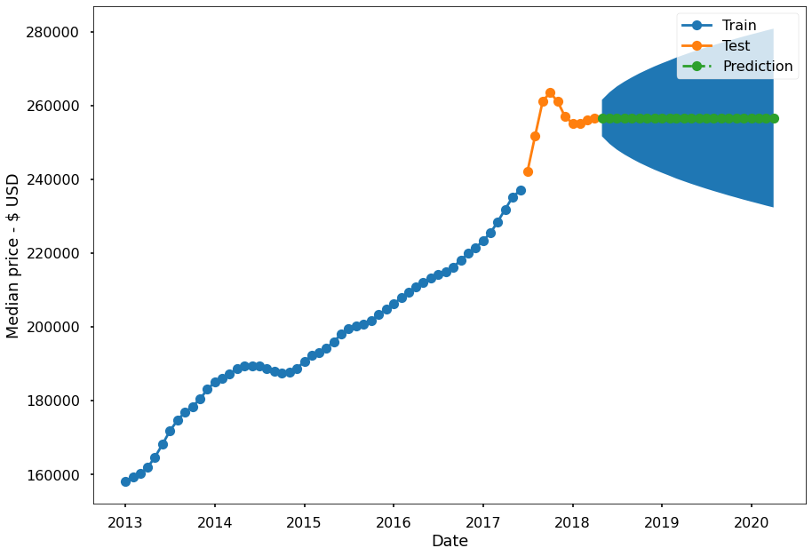


    ------------------------------------------------------------------------------------------
    
    ZIPCODE:  83704


<table class="simpletable">
<caption>SARIMAX Results</caption>
<tr>
  <th>Dep. Variable:</th>         <td>83704</td>      <th>  No. Observations:  </th>    <td>64</td>   
</tr>
<tr>
  <th>Model:</th>           <td>SARIMAX(0, 1, 0)</td> <th>  Log Likelihood     </th> <td>-556.400</td>
</tr>
<tr>
  <th>Date:</th>            <td>Wed, 23 Dec 2020</td> <th>  AIC                </th> <td>1114.800</td>
</tr>
<tr>
  <th>Time:</th>                <td>21:06:20</td>     <th>  BIC                </th> <td>1116.943</td>
</tr>
<tr>
  <th>Sample:</th>             <td>01-01-2013</td>    <th>  HQIC               </th> <td>1115.643</td>
</tr>
<tr>
  <th></th>                   <td>- 04-01-2018</td>   <th>                     </th>     <td> </td>   
</tr>
<tr>
  <th>Covariance Type:</th>        <td>opg</td>       <th>                     </th>     <td> </td>   
</tr>
</table>
<table class="simpletable">
<tr>
     <td></td>       <th>coef</th>     <th>std err</th>      <th>z</th>      <th>P>|z|</th>  <th>[0.025</th>    <th>0.975]</th>  
</tr>
<tr>
  <th>sigma2</th> <td> 2.703e+06</td> <td>  5.2e+05</td> <td>    5.193</td> <td> 0.000</td> <td> 1.68e+06</td> <td> 3.72e+06</td>
</tr>
</table>
<table class="simpletable">
<tr>
  <th>Ljung-Box (L1) (Q):</th>     <td>22.25</td> <th>  Jarque-Bera (JB):  </th> <td>18.58</td>
</tr>
<tr>
  <th>Prob(Q):</th>                <td>0.00</td>  <th>  Prob(JB):          </th> <td>0.00</td> 
</tr>
<tr>
  <th>Heteroskedasticity (H):</th> <td>2.85</td>  <th>  Skew:              </th> <td>-0.04</td>
</tr>
<tr>
  <th>Prob(H) (two-sided):</th>    <td>0.02</td>  <th>  Kurtosis:          </th> <td>5.66</td> 
</tr>
</table><br/><br/>Warnings:<br/>[1] Covariance matrix calculated using the outer product of gradients (complex-step).


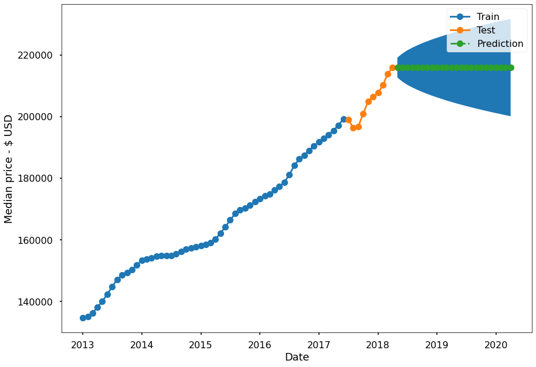


    ------------------------------------------------------------------------------------------
    
    ZIPCODE:  83706


<table class="simpletable">
<caption>SARIMAX Results</caption>
<tr>
  <th>Dep. Variable:</th>         <td>83706</td>      <th>  No. Observations:  </th>    <td>64</td>   
</tr>
<tr>
  <th>Model:</th>           <td>SARIMAX(5, 1, 1)</td> <th>  Log Likelihood     </th> <td>-620.776</td>
</tr>
<tr>
  <th>Date:</th>            <td>Wed, 23 Dec 2020</td> <th>  AIC                </th> <td>1255.551</td>
</tr>
<tr>
  <th>Time:</th>                <td>21:06:24</td>     <th>  BIC                </th> <td>1270.553</td>
</tr>
<tr>
  <th>Sample:</th>             <td>01-01-2013</td>    <th>  HQIC               </th> <td>1261.452</td>
</tr>
<tr>
  <th></th>                   <td>- 04-01-2018</td>   <th>                     </th>     <td> </td>   
</tr>
<tr>
  <th>Covariance Type:</th>        <td>opg</td>       <th>                     </th>     <td> </td>   
</tr>
</table>
<table class="simpletable">
<tr>
     <td></td>       <th>coef</th>     <th>std err</th>      <th>z</th>      <th>P>|z|</th>  <th>[0.025</th>    <th>0.975]</th>  
</tr>
<tr>
  <th>ar.L1</th>  <td>    0.9702</td> <td>    0.015</td> <td>   65.597</td> <td> 0.000</td> <td>    0.941</td> <td>    0.999</td>
</tr>
<tr>
  <th>ar.L2</th>  <td>    0.0156</td> <td>    0.009</td> <td>    1.834</td> <td> 0.067</td> <td>   -0.001</td> <td>    0.032</td>
</tr>
<tr>
  <th>ar.L3</th>  <td>    0.0160</td> <td>    0.010</td> <td>    1.565</td> <td> 0.118</td> <td>   -0.004</td> <td>    0.036</td>
</tr>
<tr>
  <th>ar.L4</th>  <td>    0.0202</td> <td>    0.010</td> <td>    1.979</td> <td> 0.048</td> <td>    0.000</td> <td>    0.040</td>
</tr>
<tr>
  <th>ar.L5</th>  <td>   -0.0592</td> <td>    0.007</td> <td>   -8.312</td> <td> 0.000</td> <td>   -0.073</td> <td>   -0.045</td>
</tr>
<tr>
  <th>ma.L1</th>  <td>   -0.9356</td> <td>    0.014</td> <td>  -66.061</td> <td> 0.000</td> <td>   -0.963</td> <td>   -0.908</td>
</tr>
<tr>
  <th>sigma2</th> <td> 5.976e+05</td> <td> 1.02e-08</td> <td> 5.84e+13</td> <td> 0.000</td> <td> 5.98e+05</td> <td> 5.98e+05</td>
</tr>
</table>
<table class="simpletable">
<tr>
  <th>Ljung-Box (L1) (Q):</th>     <td>31.05</td> <th>  Jarque-Bera (JB):  </th> <td>28.17</td>
</tr>
<tr>
  <th>Prob(Q):</th>                <td>0.00</td>  <th>  Prob(JB):          </th> <td>0.00</td> 
</tr>
<tr>
  <th>Heteroskedasticity (H):</th> <td>3.71</td>  <th>  Skew:              </th> <td>0.95</td> 
</tr>
<tr>
  <th>Prob(H) (two-sided):</th>    <td>0.00</td>  <th>  Kurtosis:          </th> <td>5.67</td> 
</tr>
</table><br/><br/>Warnings:<br/>[1] Covariance matrix calculated using the outer product of gradients (complex-step).<br/>[2] Covariance matrix is singular or near-singular, with condition number 1.13e+29. Standard errors may be unstable.


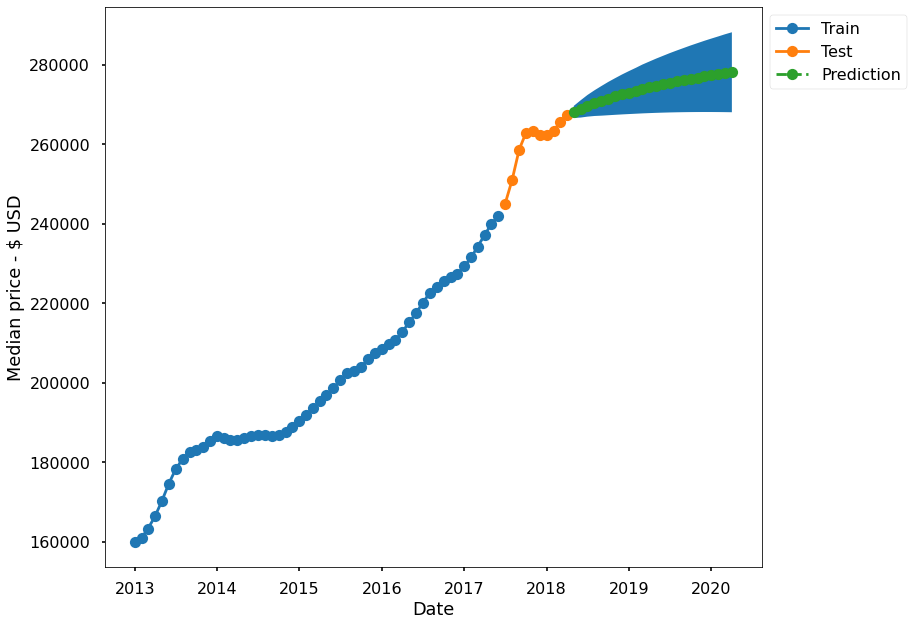


    ------------------------------------------------------------------------------------------
    
    ZIPCODE:  83705


<table class="simpletable">
<caption>SARIMAX Results</caption>
<tr>
  <th>Dep. Variable:</th>         <td>83705</td>      <th>  No. Observations:  </th>    <td>64</td>   
</tr>
<tr>
  <th>Model:</th>           <td>SARIMAX(0, 2, 2)</td> <th>  Log Likelihood     </th> <td>-508.520</td>
</tr>
<tr>
  <th>Date:</th>            <td>Wed, 23 Dec 2020</td> <th>  AIC                </th> <td>1023.040</td>
</tr>
<tr>
  <th>Time:</th>                <td>21:06:25</td>     <th>  BIC                </th> <td>1029.422</td>
</tr>
<tr>
  <th>Sample:</th>             <td>01-01-2013</td>    <th>  HQIC               </th> <td>1025.546</td>
</tr>
<tr>
  <th></th>                   <td>- 04-01-2018</td>   <th>                     </th>     <td> </td>   
</tr>
<tr>
  <th>Covariance Type:</th>        <td>opg</td>       <th>                     </th>     <td> </td>   
</tr>
</table>
<table class="simpletable">
<tr>
     <td></td>       <th>coef</th>     <th>std err</th>      <th>z</th>      <th>P>|z|</th>  <th>[0.025</th>    <th>0.975]</th>  
</tr>
<tr>
  <th>ma.L1</th>  <td>   -0.0126</td> <td>    0.031</td> <td>   -0.405</td> <td> 0.685</td> <td>   -0.074</td> <td>    0.048</td>
</tr>
<tr>
  <th>ma.L2</th>  <td>   -0.0193</td> <td>    0.050</td> <td>   -0.388</td> <td> 0.698</td> <td>   -0.117</td> <td>    0.078</td>
</tr>
<tr>
  <th>sigma2</th> <td> 6.725e+05</td> <td>  6.1e+04</td> <td>   11.017</td> <td> 0.000</td> <td> 5.53e+05</td> <td> 7.92e+05</td>
</tr>
</table>
<table class="simpletable">
<tr>
  <th>Ljung-Box (L1) (Q):</th>     <td>12.30</td> <th>  Jarque-Bera (JB):  </th> <td>110.76</td>
</tr>
<tr>
  <th>Prob(Q):</th>                <td>0.00</td>  <th>  Prob(JB):          </th>  <td>0.00</td> 
</tr>
<tr>
  <th>Heteroskedasticity (H):</th> <td>10.91</td> <th>  Skew:              </th>  <td>-1.33</td>
</tr>
<tr>
  <th>Prob(H) (two-sided):</th>    <td>0.00</td>  <th>  Kurtosis:          </th>  <td>8.98</td> 
</tr>
</table><br/><br/>Warnings:<br/>[1] Covariance matrix calculated using the outer product of gradients (complex-step).


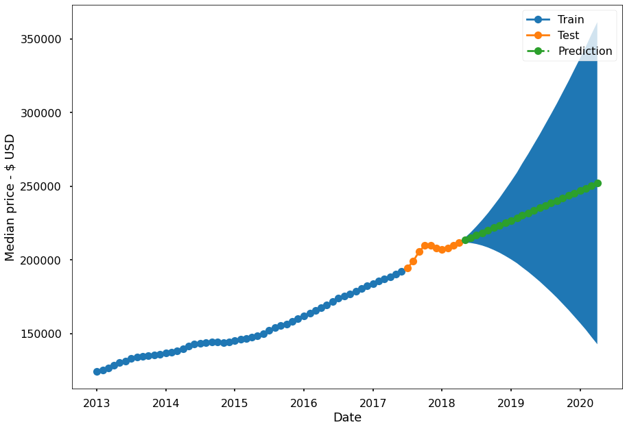


    ------------------------------------------------------------------------------------------
    
    ZIPCODE:  83702


<table class="simpletable">
<caption>SARIMAX Results</caption>
<tr>
  <th>Dep. Variable:</th>         <td>83702</td>      <th>  No. Observations:  </th>    <td>64</td>   
</tr>
<tr>
  <th>Model:</th>           <td>SARIMAX(0, 2, 0)</td> <th>  Log Likelihood     </th> <td>-567.448</td>
</tr>
<tr>
  <th>Date:</th>            <td>Wed, 23 Dec 2020</td> <th>  AIC                </th> <td>1136.896</td>
</tr>
<tr>
  <th>Time:</th>                <td>21:06:26</td>     <th>  BIC                </th> <td>1139.023</td>
</tr>
<tr>
  <th>Sample:</th>             <td>01-01-2013</td>    <th>  HQIC               </th> <td>1137.731</td>
</tr>
<tr>
  <th></th>                   <td>- 04-01-2018</td>   <th>                     </th>     <td> </td>   
</tr>
<tr>
  <th>Covariance Type:</th>        <td>opg</td>       <th>                     </th>     <td> </td>   
</tr>
</table>
<table class="simpletable">
<tr>
     <td></td>       <th>coef</th>     <th>std err</th>      <th>z</th>      <th>P>|z|</th>  <th>[0.025</th>    <th>0.975]</th>  
</tr>
<tr>
  <th>sigma2</th> <td> 5.209e+06</td> <td> 4.04e+05</td> <td>   12.899</td> <td> 0.000</td> <td> 4.42e+06</td> <td>    6e+06</td>
</tr>
</table>
<table class="simpletable">
<tr>
  <th>Ljung-Box (L1) (Q):</th>     <td>7.58</td>  <th>  Jarque-Bera (JB):  </th> <td>217.80</td>
</tr>
<tr>
  <th>Prob(Q):</th>                <td>0.01</td>  <th>  Prob(JB):          </th>  <td>0.00</td> 
</tr>
<tr>
  <th>Heteroskedasticity (H):</th> <td>15.16</td> <th>  Skew:              </th>  <td>1.74</td> 
</tr>
<tr>
  <th>Prob(H) (two-sided):</th>    <td>0.00</td>  <th>  Kurtosis:          </th>  <td>11.50</td>
</tr>
</table><br/><br/>Warnings:<br/>[1] Covariance matrix calculated using the outer product of gradients (complex-step).


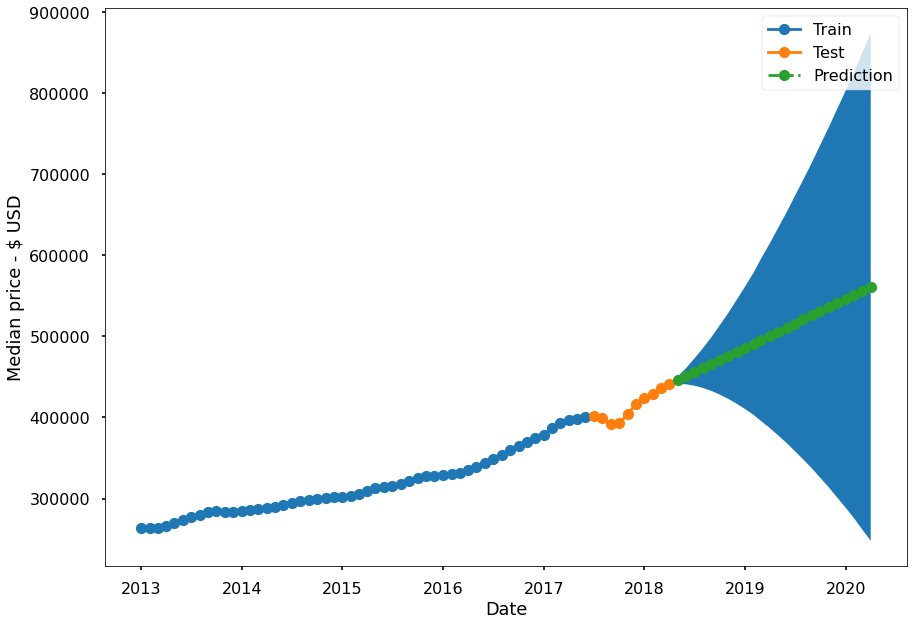


    ------------------------------------------------------------------------------------------
    
    ZIPCODE:  83616


<table class="simpletable">
<caption>SARIMAX Results</caption>
<tr>
  <th>Dep. Variable:</th>         <td>83616</td>      <th>  No. Observations:  </th>    <td>64</td>   
</tr>
<tr>
  <th>Model:</th>           <td>SARIMAX(0, 1, 0)</td> <th>  Log Likelihood     </th> <td>-627.522</td>
</tr>
<tr>
  <th>Date:</th>            <td>Wed, 23 Dec 2020</td> <th>  AIC                </th> <td>1257.045</td>
</tr>
<tr>
  <th>Time:</th>                <td>21:06:27</td>     <th>  BIC                </th> <td>1259.188</td>
</tr>
<tr>
  <th>Sample:</th>             <td>01-01-2013</td>    <th>  HQIC               </th> <td>1257.888</td>
</tr>
<tr>
  <th></th>                   <td>- 04-01-2018</td>   <th>                     </th>     <td> </td>   
</tr>
<tr>
  <th>Covariance Type:</th>        <td>opg</td>       <th>                     </th>     <td> </td>   
</tr>
</table>
<table class="simpletable">
<tr>
     <td></td>       <th>coef</th>     <th>std err</th>      <th>z</th>      <th>P>|z|</th>  <th>[0.025</th>    <th>0.975]</th>  
</tr>
<tr>
  <th>sigma2</th> <td> 2.584e+07</td> <td> 1.84e+06</td> <td>   14.067</td> <td> 0.000</td> <td> 2.22e+07</td> <td> 2.94e+07</td>
</tr>
</table>
<table class="simpletable">
<tr>
  <th>Ljung-Box (L1) (Q):</th>     <td>28.61</td> <th>  Jarque-Bera (JB):  </th> <td>407.20</td>
</tr>
<tr>
  <th>Prob(Q):</th>                <td>0.00</td>  <th>  Prob(JB):          </th>  <td>0.00</td> 
</tr>
<tr>
  <th>Heteroskedasticity (H):</th> <td>13.91</td> <th>  Skew:              </th>  <td>2.84</td> 
</tr>
<tr>
  <th>Prob(H) (two-sided):</th>    <td>0.00</td>  <th>  Kurtosis:          </th>  <td>14.08</td>
</tr>
</table><br/><br/>Warnings:<br/>[1] Covariance matrix calculated using the outer product of gradients (complex-step).


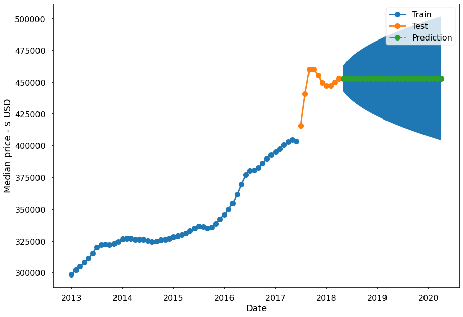


    ------------------------------------------------------------------------------------------
    
    ZIPCODE:  83713


<table class="simpletable">
<caption>SARIMAX Results</caption>
<tr>
  <th>Dep. Variable:</th>         <td>83713</td>      <th>  No. Observations:  </th>    <td>64</td>   
</tr>
<tr>
  <th>Model:</th>           <td>SARIMAX(3, 1, 1)</td> <th>  Log Likelihood     </th> <td>-635.980</td>
</tr>
<tr>
  <th>Date:</th>            <td>Wed, 23 Dec 2020</td> <th>  AIC                </th> <td>1281.961</td>
</tr>
<tr>
  <th>Time:</th>                <td>21:06:31</td>     <th>  BIC                </th> <td>1292.676</td>
</tr>
<tr>
  <th>Sample:</th>             <td>01-01-2013</td>    <th>  HQIC               </th> <td>1286.175</td>
</tr>
<tr>
  <th></th>                   <td>- 04-01-2018</td>   <th>                     </th>     <td> </td>   
</tr>
<tr>
  <th>Covariance Type:</th>        <td>opg</td>       <th>                     </th>     <td> </td>   
</tr>
</table>
<table class="simpletable">
<tr>
     <td></td>       <th>coef</th>     <th>std err</th>      <th>z</th>      <th>P>|z|</th>  <th>[0.025</th>    <th>0.975]</th>  
</tr>
<tr>
  <th>ar.L1</th>  <td>    1.0277</td> <td>    0.008</td> <td>  132.534</td> <td> 0.000</td> <td>    1.012</td> <td>    1.043</td>
</tr>
<tr>
  <th>ar.L2</th>  <td>   -0.0215</td> <td>    0.025</td> <td>   -0.874</td> <td> 0.382</td> <td>   -0.070</td> <td>    0.027</td>
</tr>
<tr>
  <th>ar.L3</th>  <td>   -0.0067</td> <td>    0.023</td> <td>   -0.292</td> <td> 0.771</td> <td>   -0.052</td> <td>    0.038</td>
</tr>
<tr>
  <th>ma.L1</th>  <td>   -0.9963</td> <td>    0.013</td> <td>  -74.147</td> <td> 0.000</td> <td>   -1.023</td> <td>   -0.970</td>
</tr>
<tr>
  <th>sigma2</th> <td> 1.664e+06</td> <td> 8.26e-09</td> <td> 2.01e+14</td> <td> 0.000</td> <td> 1.66e+06</td> <td> 1.66e+06</td>
</tr>
</table>
<table class="simpletable">
<tr>
  <th>Ljung-Box (L1) (Q):</th>     <td>30.10</td> <th>  Jarque-Bera (JB):  </th> <td>236.75</td>
</tr>
<tr>
  <th>Prob(Q):</th>                <td>0.00</td>  <th>  Prob(JB):          </th>  <td>0.00</td> 
</tr>
<tr>
  <th>Heteroskedasticity (H):</th> <td>9.10</td>  <th>  Skew:              </th>  <td>1.87</td> 
</tr>
<tr>
  <th>Prob(H) (two-sided):</th>    <td>0.00</td>  <th>  Kurtosis:          </th>  <td>11.73</td>
</tr>
</table><br/><br/>Warnings:<br/>[1] Covariance matrix calculated using the outer product of gradients (complex-step).<br/>[2] Covariance matrix is singular or near-singular, with condition number 1.58e+29. Standard errors may be unstable.


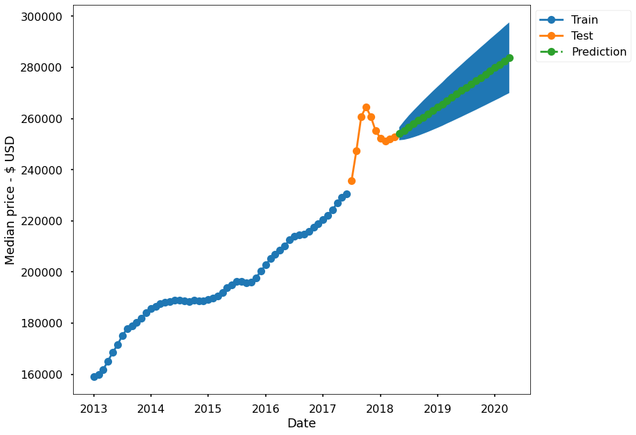


    ------------------------------------------------------------------------------------------
    
    ZIPCODE:  83714


<table class="simpletable">
<caption>SARIMAX Results</caption>
<tr>
  <th>Dep. Variable:</th>         <td>83714</td>      <th>  No. Observations:  </th>    <td>64</td>   
</tr>
<tr>
  <th>Model:</th>           <td>SARIMAX(4, 1, 1)</td> <th>  Log Likelihood     </th> <td>-585.172</td>
</tr>
<tr>
  <th>Date:</th>            <td>Wed, 23 Dec 2020</td> <th>  AIC                </th> <td>1182.344</td>
</tr>
<tr>
  <th>Time:</th>                <td>21:06:35</td>     <th>  BIC                </th> <td>1195.203</td>
</tr>
<tr>
  <th>Sample:</th>             <td>01-01-2013</td>    <th>  HQIC               </th> <td>1187.401</td>
</tr>
<tr>
  <th></th>                   <td>- 04-01-2018</td>   <th>                     </th>     <td> </td>   
</tr>
<tr>
  <th>Covariance Type:</th>        <td>opg</td>       <th>                     </th>     <td> </td>   
</tr>
</table>
<table class="simpletable">
<tr>
     <td></td>       <th>coef</th>     <th>std err</th>      <th>z</th>      <th>P>|z|</th>  <th>[0.025</th>    <th>0.975]</th>  
</tr>
<tr>
  <th>ar.L1</th>  <td>    1.0045</td> <td>    0.009</td> <td>  105.812</td> <td> 0.000</td> <td>    0.986</td> <td>    1.023</td>
</tr>
<tr>
  <th>ar.L2</th>  <td>   -0.0048</td> <td>    0.036</td> <td>   -0.136</td> <td> 0.892</td> <td>   -0.075</td> <td>    0.065</td>
</tr>
<tr>
  <th>ar.L3</th>  <td>    0.0151</td> <td>    0.045</td> <td>    0.338</td> <td> 0.735</td> <td>   -0.072</td> <td>    0.103</td>
</tr>
<tr>
  <th>ar.L4</th>  <td>   -0.0149</td> <td>    0.027</td> <td>   -0.546</td> <td> 0.585</td> <td>   -0.069</td> <td>    0.039</td>
</tr>
<tr>
  <th>ma.L1</th>  <td>   -0.9976</td> <td>    0.018</td> <td>  -55.063</td> <td> 0.000</td> <td>   -1.033</td> <td>   -0.962</td>
</tr>
<tr>
  <th>sigma2</th> <td> 1.508e+06</td> <td> 5.68e-09</td> <td> 2.66e+14</td> <td> 0.000</td> <td> 1.51e+06</td> <td> 1.51e+06</td>
</tr>
</table>
<table class="simpletable">
<tr>
  <th>Ljung-Box (L1) (Q):</th>     <td>28.29</td> <th>  Jarque-Bera (JB):  </th> <td>68.08</td>
</tr>
<tr>
  <th>Prob(Q):</th>                <td>0.00</td>  <th>  Prob(JB):          </th> <td>0.00</td> 
</tr>
<tr>
  <th>Heteroskedasticity (H):</th> <td>2.77</td>  <th>  Skew:              </th> <td>1.37</td> 
</tr>
<tr>
  <th>Prob(H) (two-sided):</th>    <td>0.02</td>  <th>  Kurtosis:          </th> <td>7.29</td> 
</tr>
</table><br/><br/>Warnings:<br/>[1] Covariance matrix calculated using the outer product of gradients (complex-step).<br/>[2] Covariance matrix is singular or near-singular, with condition number 5.64e+29. Standard errors may be unstable.


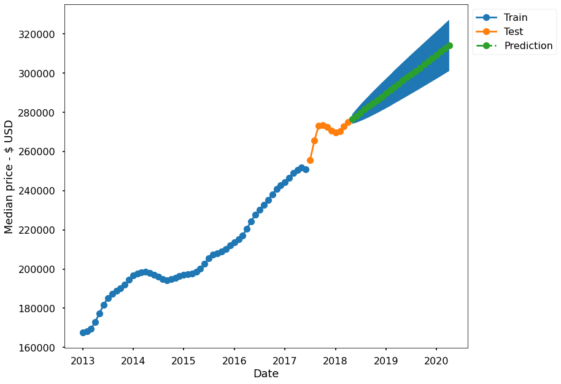


    ------------------------------------------------------------------------------------------
    
    ZIPCODE:  83703


<table class="simpletable">
<caption>SARIMAX Results</caption>
<tr>
  <th>Dep. Variable:</th>         <td>83703</td>      <th>  No. Observations:  </th>    <td>64</td>   
</tr>
<tr>
  <th>Model:</th>           <td>SARIMAX(0, 2, 0)</td> <th>  Log Likelihood     </th> <td>-524.706</td>
</tr>
<tr>
  <th>Date:</th>            <td>Wed, 23 Dec 2020</td> <th>  AIC                </th> <td>1051.412</td>
</tr>
<tr>
  <th>Time:</th>                <td>21:06:36</td>     <th>  BIC                </th> <td>1053.539</td>
</tr>
<tr>
  <th>Sample:</th>             <td>01-01-2013</td>    <th>  HQIC               </th> <td>1052.247</td>
</tr>
<tr>
  <th></th>                   <td>- 04-01-2018</td>   <th>                     </th>     <td> </td>   
</tr>
<tr>
  <th>Covariance Type:</th>        <td>opg</td>       <th>                     </th>     <td> </td>   
</tr>
</table>
<table class="simpletable">
<tr>
     <td></td>       <th>coef</th>     <th>std err</th>      <th>z</th>      <th>P>|z|</th>  <th>[0.025</th>    <th>0.975]</th>  
</tr>
<tr>
  <th>sigma2</th> <td> 1.312e+06</td> <td> 1.15e+05</td> <td>   11.398</td> <td> 0.000</td> <td> 1.09e+06</td> <td> 1.54e+06</td>
</tr>
</table>
<table class="simpletable">
<tr>
  <th>Ljung-Box (L1) (Q):</th>     <td>8.19</td> <th>  Jarque-Bera (JB):  </th> <td>105.02</td>
</tr>
<tr>
  <th>Prob(Q):</th>                <td>0.00</td> <th>  Prob(JB):          </th>  <td>0.00</td> 
</tr>
<tr>
  <th>Heteroskedasticity (H):</th> <td>9.18</td> <th>  Skew:              </th>  <td>0.08</td> 
</tr>
<tr>
  <th>Prob(H) (two-sided):</th>    <td>0.00</td> <th>  Kurtosis:          </th>  <td>9.37</td> 
</tr>
</table><br/><br/>Warnings:<br/>[1] Covariance matrix calculated using the outer product of gradients (complex-step).


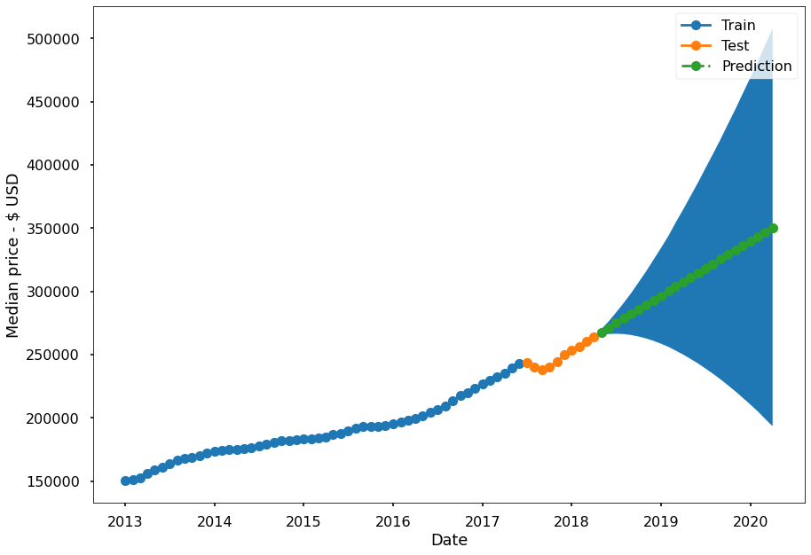


    ------------------------------------------------------------------------------------------
    
    ZIPCODE:  83716


<table class="simpletable">
<caption>SARIMAX Results</caption>
<tr>
  <th>Dep. Variable:</th>         <td>83716</td>      <th>  No. Observations:  </th>    <td>64</td>   
</tr>
<tr>
  <th>Model:</th>           <td>SARIMAX(0, 1, 0)</td> <th>  Log Likelihood     </th> <td>-565.042</td>
</tr>
<tr>
  <th>Date:</th>            <td>Wed, 23 Dec 2020</td> <th>  AIC                </th> <td>1132.084</td>
</tr>
<tr>
  <th>Time:</th>                <td>21:06:37</td>     <th>  BIC                </th> <td>1134.227</td>
</tr>
<tr>
  <th>Sample:</th>             <td>01-01-2013</td>    <th>  HQIC               </th> <td>1132.927</td>
</tr>
<tr>
  <th></th>                   <td>- 04-01-2018</td>   <th>                     </th>     <td> </td>   
</tr>
<tr>
  <th>Covariance Type:</th>        <td>opg</td>       <th>                     </th>     <td> </td>   
</tr>
</table>
<table class="simpletable">
<tr>
     <td></td>       <th>coef</th>     <th>std err</th>      <th>z</th>      <th>P>|z|</th>  <th>[0.025</th>    <th>0.975]</th>  
</tr>
<tr>
  <th>sigma2</th> <td> 3.556e+06</td> <td>  6.7e+05</td> <td>    5.305</td> <td> 0.000</td> <td> 2.24e+06</td> <td> 4.87e+06</td>
</tr>
</table>
<table class="simpletable">
<tr>
  <th>Ljung-Box (L1) (Q):</th>     <td>23.46</td> <th>  Jarque-Bera (JB):  </th> <td>3.93</td>
</tr>
<tr>
  <th>Prob(Q):</th>                <td>0.00</td>  <th>  Prob(JB):          </th> <td>0.14</td>
</tr>
<tr>
  <th>Heteroskedasticity (H):</th> <td>0.89</td>  <th>  Skew:              </th> <td>0.13</td>
</tr>
<tr>
  <th>Prob(H) (two-sided):</th>    <td>0.80</td>  <th>  Kurtosis:          </th> <td>4.20</td>
</tr>
</table><br/><br/>Warnings:<br/>[1] Covariance matrix calculated using the outer product of gradients (complex-step).


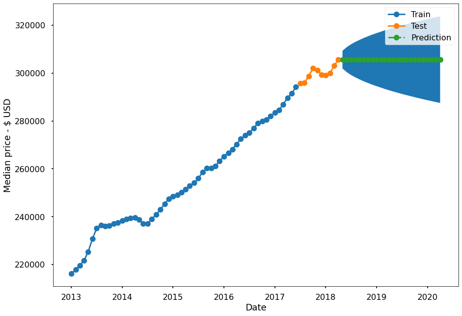


    ------------------------------------------------------------------------------------------
    
    ZIPCODE:  83712


<table class="simpletable">
<caption>SARIMAX Results</caption>
<tr>
  <th>Dep. Variable:</th>         <td>83712</td>      <th>  No. Observations:  </th>    <td>64</td>   
</tr>
<tr>
  <th>Model:</th>           <td>SARIMAX(0, 1, 0)</td> <th>  Log Likelihood     </th> <td>-602.552</td>
</tr>
<tr>
  <th>Date:</th>            <td>Wed, 23 Dec 2020</td> <th>  AIC                </th> <td>1207.103</td>
</tr>
<tr>
  <th>Time:</th>                <td>21:06:38</td>     <th>  BIC                </th> <td>1209.246</td>
</tr>
<tr>
  <th>Sample:</th>             <td>01-01-2013</td>    <th>  HQIC               </th> <td>1207.946</td>
</tr>
<tr>
  <th></th>                   <td>- 04-01-2018</td>   <th>                     </th>     <td> </td>   
</tr>
<tr>
  <th>Covariance Type:</th>        <td>opg</td>       <th>                     </th>     <td> </td>   
</tr>
</table>
<table class="simpletable">
<tr>
     <td></td>       <th>coef</th>     <th>std err</th>      <th>z</th>      <th>P>|z|</th>  <th>[0.025</th>    <th>0.975]</th>  
</tr>
<tr>
  <th>sigma2</th> <td>  1.17e+07</td> <td> 1.86e+06</td> <td>    6.287</td> <td> 0.000</td> <td> 8.05e+06</td> <td> 1.53e+07</td>
</tr>
</table>
<table class="simpletable">
<tr>
  <th>Ljung-Box (L1) (Q):</th>     <td>25.69</td> <th>  Jarque-Bera (JB):  </th> <td>5.55</td>
</tr>
<tr>
  <th>Prob(Q):</th>                <td>0.00</td>  <th>  Prob(JB):          </th> <td>0.06</td>
</tr>
<tr>
  <th>Heteroskedasticity (H):</th> <td>4.49</td>  <th>  Skew:              </th> <td>0.66</td>
</tr>
<tr>
  <th>Prob(H) (two-sided):</th>    <td>0.00</td>  <th>  Kurtosis:          </th> <td>3.59</td>
</tr>
</table><br/><br/>Warnings:<br/>[1] Covariance matrix calculated using the outer product of gradients (complex-step).


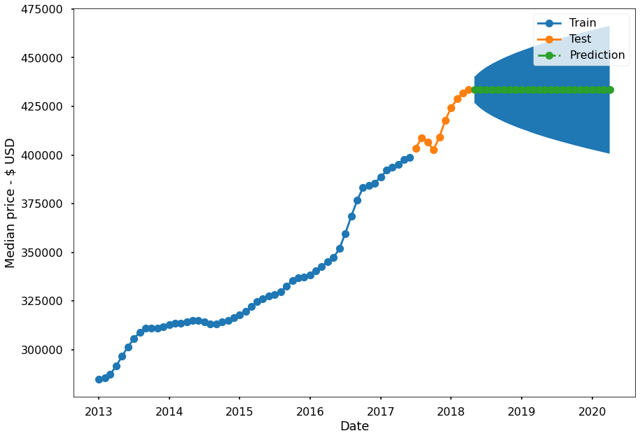


    ------------------------------------------------------------------------------------------
    


# iNTERPRET

> - **Since all of our predictions were stored in a dictionary, we can easily calculate our expected ROI by subtracting the 2-year forecated median value (2020-04-01) for both the upper and lower confidence intervals from the starting median home price (2018-04-01)**

> - **This will give us are highest ROI potential, as well as our lowest.**


```python
# BUILD A FUNCTION TO CALCULATE ROI BASED OFF THE 2-YEAR FORECASTS

ROI_list = [['Zipcode', 'Investment price', 'Mean ROI', 
             'High ROI', 'Low ROI', '% ROI', '% High', '% Low']]
ROI_upper = []
ROI_lower = []
  
for zipcode in zipcode_list: 
    '''Print out max and min ROI and risk assessment for each zipcode'''
    
    print('Zipcode: ', zipcode)
    print('--------')
    start_price = round(RESULTS[zipcode]['test']['2018-04-01'])
    lower = round(RESULTS[zipcode]['pred_df']['lower']['2020-04-01'])
    upper = round(RESULTS[zipcode]['pred_df']['upper']['2020-04-01'])
    mean = round(RESULTS[zipcode]['pred_df']['prediction']['2020-04-01'])

    ROI_lower = round(lower - start_price)
    ROI_upper = round(upper - start_price)

    percent_ROI = (mean - start_price)/start_price * 100
    percent_lower = ROI_lower/start_price * 100
    percent_upper = ROI_upper/start_price * 100
    
    ROI = f"Max ROI: ${ROI_upper} <---> Min ROI: ${ROI_lower}"
    ROI_list.append([zipcode, start_price, mean, upper, lower, percent_ROI, 
                    percent_upper, percent_lower]) 
    
    
    if ROI_lower <= 0: 
        print('High-risk - negative ROI possible')

    else: 
        print('Low-risk')
    
    print(ROI)
    print(f"\n")
    
ROI_df = pd.DataFrame(ROI_list[1:], columns=ROI_list[0]).round(2).sort_values('% Low')

ROI_df.set_index('Zipcode', inplace=True)

    

```

    Zipcode:  83709
    --------
    High-risk - negative ROI possible
    Max ROI: $24231 <---> Min ROI: $-24231
    
    
    Zipcode:  83704
    --------
    High-risk - negative ROI possible
    Max ROI: $15785 <---> Min ROI: $-15785
    
    
    Zipcode:  83706
    --------
    Low-risk
    Max ROI: $20754 <---> Min ROI: $620
    
    
    Zipcode:  83705
    --------
    High-risk - negative ROI possible
    Max ROI: $149642 <---> Min ROI: $-68901
    
    
    Zipcode:  83702
    --------
    High-risk - negative ROI possible
    Max ROI: $433121 <---> Min ROI: $-193121
    
    
    Zipcode:  83616
    --------
    High-risk - negative ROI possible
    Max ROI: $48813 <---> Min ROI: $-48813
    
    
    Zipcode:  83713
    --------
    Low-risk
    Max ROI: $44804 <---> Min ROI: $17167
    
    
    Zipcode:  83714
    --------
    Low-risk
    Max ROI: $52359 <---> Min ROI: $26198
    
    
    Zipcode:  83703
    --------
    High-risk - negative ROI possible
    Max ROI: $243563 <---> Min ROI: $-70763
    
    
    Zipcode:  83716
    --------
    High-risk - negative ROI possible
    Max ROI: $18106 <---> Min ROI: $-18106
    
    
    Zipcode:  83712
    --------
    High-risk - negative ROI possible
    Max ROI: $32840 <---> Min ROI: $-32840
    
    


```python
def color_negative_red(val):
    """
    Takes a scalar and returns a string with
    the css property `'color: red'` for negative
    strings, black otherwise.
    """
    color = 'red' if val < 0 else 'black'
    return 'color: %s' % color

ROI_df2 = ROI_df.style.applymap(color_negative_red).\
            background_gradient(subset=['Mean ROI'], cmap='Greens').\
            format("$ {}", subset=['Mean ROI', 'Investment price', 'High ROI',
                                  'Low ROI'])

ROI_df2


```


<style  type="text/css" >
    #T_56cb9642_45f5_11eb_bffc_3e22fb470a99row0_col0 {
            color:  black;
        }    #T_56cb9642_45f5_11eb_bffc_3e22fb470a99row0_col1 {
            color:  black;
            background-color:  #00441b;
            color:  #f1f1f1;
        }    #T_56cb9642_45f5_11eb_bffc_3e22fb470a99row0_col2 {
            color:  black;
        }    #T_56cb9642_45f5_11eb_bffc_3e22fb470a99row0_col3 {
            color:  black;
        }    #T_56cb9642_45f5_11eb_bffc_3e22fb470a99row0_col4 {
            color:  black;
        }    #T_56cb9642_45f5_11eb_bffc_3e22fb470a99row0_col5 {
            color:  black;
        }    #T_56cb9642_45f5_11eb_bffc_3e22fb470a99row0_col6 {
            color:  red;
        }    #T_56cb9642_45f5_11eb_bffc_3e22fb470a99row1_col0 {
            color:  black;
        }    #T_56cb9642_45f5_11eb_bffc_3e22fb470a99row1_col1 {
            color:  black;
            background-color:  #e8f6e4;
            color:  #000000;
        }    #T_56cb9642_45f5_11eb_bffc_3e22fb470a99row1_col2 {
            color:  black;
        }    #T_56cb9642_45f5_11eb_bffc_3e22fb470a99row1_col3 {
            color:  black;
        }    #T_56cb9642_45f5_11eb_bffc_3e22fb470a99row1_col4 {
            color:  black;
        }    #T_56cb9642_45f5_11eb_bffc_3e22fb470a99row1_col5 {
            color:  black;
        }    #T_56cb9642_45f5_11eb_bffc_3e22fb470a99row1_col6 {
            color:  red;
        }    #T_56cb9642_45f5_11eb_bffc_3e22fb470a99row2_col0 {
            color:  black;
        }    #T_56cb9642_45f5_11eb_bffc_3e22fb470a99row2_col1 {
            color:  black;
            background-color:  #9cd797;
            color:  #000000;
        }    #T_56cb9642_45f5_11eb_bffc_3e22fb470a99row2_col2 {
            color:  black;
        }    #T_56cb9642_45f5_11eb_bffc_3e22fb470a99row2_col3 {
            color:  black;
        }    #T_56cb9642_45f5_11eb_bffc_3e22fb470a99row2_col4 {
            color:  black;
        }    #T_56cb9642_45f5_11eb_bffc_3e22fb470a99row2_col5 {
            color:  black;
        }    #T_56cb9642_45f5_11eb_bffc_3e22fb470a99row2_col6 {
            color:  red;
        }    #T_56cb9642_45f5_11eb_bffc_3e22fb470a99row3_col0 {
            color:  black;
        }    #T_56cb9642_45f5_11eb_bffc_3e22fb470a99row3_col1 {
            color:  black;
            background-color:  #319a50;
            color:  #000000;
        }    #T_56cb9642_45f5_11eb_bffc_3e22fb470a99row3_col2 {
            color:  black;
        }    #T_56cb9642_45f5_11eb_bffc_3e22fb470a99row3_col3 {
            color:  black;
        }    #T_56cb9642_45f5_11eb_bffc_3e22fb470a99row3_col4 {
            color:  black;
        }    #T_56cb9642_45f5_11eb_bffc_3e22fb470a99row3_col5 {
            color:  black;
        }    #T_56cb9642_45f5_11eb_bffc_3e22fb470a99row3_col6 {
            color:  red;
        }    #T_56cb9642_45f5_11eb_bffc_3e22fb470a99row4_col0 {
            color:  black;
        }    #T_56cb9642_45f5_11eb_bffc_3e22fb470a99row4_col1 {
            color:  black;
            background-color:  #e6f5e1;
            color:  #000000;
        }    #T_56cb9642_45f5_11eb_bffc_3e22fb470a99row4_col2 {
            color:  black;
        }    #T_56cb9642_45f5_11eb_bffc_3e22fb470a99row4_col3 {
            color:  black;
        }    #T_56cb9642_45f5_11eb_bffc_3e22fb470a99row4_col4 {
            color:  black;
        }    #T_56cb9642_45f5_11eb_bffc_3e22fb470a99row4_col5 {
            color:  black;
        }    #T_56cb9642_45f5_11eb_bffc_3e22fb470a99row4_col6 {
            color:  red;
        }    #T_56cb9642_45f5_11eb_bffc_3e22fb470a99row5_col0 {
            color:  black;
        }    #T_56cb9642_45f5_11eb_bffc_3e22fb470a99row5_col1 {
            color:  black;
            background-color:  #3fa95c;
            color:  #000000;
        }    #T_56cb9642_45f5_11eb_bffc_3e22fb470a99row5_col2 {
            color:  black;
        }    #T_56cb9642_45f5_11eb_bffc_3e22fb470a99row5_col3 {
            color:  black;
        }    #T_56cb9642_45f5_11eb_bffc_3e22fb470a99row5_col4 {
            color:  black;
        }    #T_56cb9642_45f5_11eb_bffc_3e22fb470a99row5_col5 {
            color:  black;
        }    #T_56cb9642_45f5_11eb_bffc_3e22fb470a99row5_col6 {
            color:  red;
        }    #T_56cb9642_45f5_11eb_bffc_3e22fb470a99row6_col0 {
            color:  black;
        }    #T_56cb9642_45f5_11eb_bffc_3e22fb470a99row6_col1 {
            color:  black;
            background-color:  #f7fcf5;
            color:  #000000;
        }    #T_56cb9642_45f5_11eb_bffc_3e22fb470a99row6_col2 {
            color:  black;
        }    #T_56cb9642_45f5_11eb_bffc_3e22fb470a99row6_col3 {
            color:  black;
        }    #T_56cb9642_45f5_11eb_bffc_3e22fb470a99row6_col4 {
            color:  black;
        }    #T_56cb9642_45f5_11eb_bffc_3e22fb470a99row6_col5 {
            color:  black;
        }    #T_56cb9642_45f5_11eb_bffc_3e22fb470a99row6_col6 {
            color:  red;
        }    #T_56cb9642_45f5_11eb_bffc_3e22fb470a99row7_col0 {
            color:  black;
        }    #T_56cb9642_45f5_11eb_bffc_3e22fb470a99row7_col1 {
            color:  black;
            background-color:  #c4e8bd;
            color:  #000000;
        }    #T_56cb9642_45f5_11eb_bffc_3e22fb470a99row7_col2 {
            color:  black;
        }    #T_56cb9642_45f5_11eb_bffc_3e22fb470a99row7_col3 {
            color:  black;
        }    #T_56cb9642_45f5_11eb_bffc_3e22fb470a99row7_col4 {
            color:  black;
        }    #T_56cb9642_45f5_11eb_bffc_3e22fb470a99row7_col5 {
            color:  black;
        }    #T_56cb9642_45f5_11eb_bffc_3e22fb470a99row7_col6 {
            color:  red;
        }    #T_56cb9642_45f5_11eb_bffc_3e22fb470a99row8_col0 {
            color:  black;
        }    #T_56cb9642_45f5_11eb_bffc_3e22fb470a99row8_col1 {
            color:  black;
            background-color:  #d8f0d2;
            color:  #000000;
        }    #T_56cb9642_45f5_11eb_bffc_3e22fb470a99row8_col2 {
            color:  black;
        }    #T_56cb9642_45f5_11eb_bffc_3e22fb470a99row8_col3 {
            color:  black;
        }    #T_56cb9642_45f5_11eb_bffc_3e22fb470a99row8_col4 {
            color:  black;
        }    #T_56cb9642_45f5_11eb_bffc_3e22fb470a99row8_col5 {
            color:  black;
        }    #T_56cb9642_45f5_11eb_bffc_3e22fb470a99row8_col6 {
            color:  black;
        }    #T_56cb9642_45f5_11eb_bffc_3e22fb470a99row9_col0 {
            color:  black;
        }    #T_56cb9642_45f5_11eb_bffc_3e22fb470a99row9_col1 {
            color:  black;
            background-color:  #d4eece;
            color:  #000000;
        }    #T_56cb9642_45f5_11eb_bffc_3e22fb470a99row9_col2 {
            color:  black;
        }    #T_56cb9642_45f5_11eb_bffc_3e22fb470a99row9_col3 {
            color:  black;
        }    #T_56cb9642_45f5_11eb_bffc_3e22fb470a99row9_col4 {
            color:  black;
        }    #T_56cb9642_45f5_11eb_bffc_3e22fb470a99row9_col5 {
            color:  black;
        }    #T_56cb9642_45f5_11eb_bffc_3e22fb470a99row9_col6 {
            color:  black;
        }    #T_56cb9642_45f5_11eb_bffc_3e22fb470a99row10_col0 {
            color:  black;
        }    #T_56cb9642_45f5_11eb_bffc_3e22fb470a99row10_col1 {
            color:  black;
            background-color:  #bde5b6;
            color:  #000000;
        }    #T_56cb9642_45f5_11eb_bffc_3e22fb470a99row10_col2 {
            color:  black;
        }    #T_56cb9642_45f5_11eb_bffc_3e22fb470a99row10_col3 {
            color:  black;
        }    #T_56cb9642_45f5_11eb_bffc_3e22fb470a99row10_col4 {
            color:  black;
        }    #T_56cb9642_45f5_11eb_bffc_3e22fb470a99row10_col5 {
            color:  black;
        }    #T_56cb9642_45f5_11eb_bffc_3e22fb470a99row10_col6 {
            color:  black;
        }</style><table id="T_56cb9642_45f5_11eb_bffc_3e22fb470a99" ><thead>    <tr>        <th class="blank level0" ></th>        <th class="col_heading level0 col0" >Investment price</th>        <th class="col_heading level0 col1" >Mean ROI</th>        <th class="col_heading level0 col2" >High ROI</th>        <th class="col_heading level0 col3" >Low ROI</th>        <th class="col_heading level0 col4" >% ROI</th>        <th class="col_heading level0 col5" >% High</th>        <th class="col_heading level0 col6" >% Low</th>    </tr>    <tr>        <th class="index_name level0" >Zipcode</th>        <th class="blank" ></th>        <th class="blank" ></th>        <th class="blank" ></th>        <th class="blank" ></th>        <th class="blank" ></th>        <th class="blank" ></th>        <th class="blank" ></th>    </tr></thead><tbody>
                <tr>
                        <th id="T_56cb9642_45f5_11eb_bffc_3e22fb470a99level0_row0" class="row_heading level0 row0" >83702</th>
                        <td id="T_56cb9642_45f5_11eb_bffc_3e22fb470a99row0_col0" class="data row0 col0" >$ 441000</td>
                        <td id="T_56cb9642_45f5_11eb_bffc_3e22fb470a99row0_col1" class="data row0 col1" >$ 561000</td>
                        <td id="T_56cb9642_45f5_11eb_bffc_3e22fb470a99row0_col2" class="data row0 col2" >$ 874121</td>
                        <td id="T_56cb9642_45f5_11eb_bffc_3e22fb470a99row0_col3" class="data row0 col3" >$ 247879</td>
                        <td id="T_56cb9642_45f5_11eb_bffc_3e22fb470a99row0_col4" class="data row0 col4" >27.21</td>
                        <td id="T_56cb9642_45f5_11eb_bffc_3e22fb470a99row0_col5" class="data row0 col5" >98.21</td>
                        <td id="T_56cb9642_45f5_11eb_bffc_3e22fb470a99row0_col6" class="data row0 col6" >-43.79</td>
            </tr>
            <tr>
                        <th id="T_56cb9642_45f5_11eb_bffc_3e22fb470a99level0_row1" class="row_heading level0 row1" >83705</th>
                        <td id="T_56cb9642_45f5_11eb_bffc_3e22fb470a99row1_col0" class="data row1 col0" >$ 211800</td>
                        <td id="T_56cb9642_45f5_11eb_bffc_3e22fb470a99row1_col1" class="data row1 col1" >$ 252170</td>
                        <td id="T_56cb9642_45f5_11eb_bffc_3e22fb470a99row1_col2" class="data row1 col2" >$ 361442</td>
                        <td id="T_56cb9642_45f5_11eb_bffc_3e22fb470a99row1_col3" class="data row1 col3" >$ 142899</td>
                        <td id="T_56cb9642_45f5_11eb_bffc_3e22fb470a99row1_col4" class="data row1 col4" >19.06</td>
                        <td id="T_56cb9642_45f5_11eb_bffc_3e22fb470a99row1_col5" class="data row1 col5" >70.65</td>
                        <td id="T_56cb9642_45f5_11eb_bffc_3e22fb470a99row1_col6" class="data row1 col6" >-32.53</td>
            </tr>
            <tr>
                        <th id="T_56cb9642_45f5_11eb_bffc_3e22fb470a99level0_row2" class="row_heading level0 row2" >83703</th>
                        <td id="T_56cb9642_45f5_11eb_bffc_3e22fb470a99row2_col0" class="data row2 col0" >$ 264200</td>
                        <td id="T_56cb9642_45f5_11eb_bffc_3e22fb470a99row2_col1" class="data row2 col1" >$ 350600</td>
                        <td id="T_56cb9642_45f5_11eb_bffc_3e22fb470a99row2_col2" class="data row2 col2" >$ 507763</td>
                        <td id="T_56cb9642_45f5_11eb_bffc_3e22fb470a99row2_col3" class="data row2 col3" >$ 193437</td>
                        <td id="T_56cb9642_45f5_11eb_bffc_3e22fb470a99row2_col4" class="data row2 col4" >32.7</td>
                        <td id="T_56cb9642_45f5_11eb_bffc_3e22fb470a99row2_col5" class="data row2 col5" >92.19</td>
                        <td id="T_56cb9642_45f5_11eb_bffc_3e22fb470a99row2_col6" class="data row2 col6" >-26.78</td>
            </tr>
            <tr>
                        <th id="T_56cb9642_45f5_11eb_bffc_3e22fb470a99level0_row3" class="row_heading level0 row3" >83616</th>
                        <td id="T_56cb9642_45f5_11eb_bffc_3e22fb470a99row3_col0" class="data row3 col0" >$ 453200</td>
                        <td id="T_56cb9642_45f5_11eb_bffc_3e22fb470a99row3_col1" class="data row3 col1" >$ 453200</td>
                        <td id="T_56cb9642_45f5_11eb_bffc_3e22fb470a99row3_col2" class="data row3 col2" >$ 502013</td>
                        <td id="T_56cb9642_45f5_11eb_bffc_3e22fb470a99row3_col3" class="data row3 col3" >$ 404387</td>
                        <td id="T_56cb9642_45f5_11eb_bffc_3e22fb470a99row3_col4" class="data row3 col4" >0</td>
                        <td id="T_56cb9642_45f5_11eb_bffc_3e22fb470a99row3_col5" class="data row3 col5" >10.77</td>
                        <td id="T_56cb9642_45f5_11eb_bffc_3e22fb470a99row3_col6" class="data row3 col6" >-10.77</td>
            </tr>
            <tr>
                        <th id="T_56cb9642_45f5_11eb_bffc_3e22fb470a99level0_row4" class="row_heading level0 row4" >83709</th>
                        <td id="T_56cb9642_45f5_11eb_bffc_3e22fb470a99row4_col0" class="data row4 col0" >$ 256600</td>
                        <td id="T_56cb9642_45f5_11eb_bffc_3e22fb470a99row4_col1" class="data row4 col1" >$ 256600</td>
                        <td id="T_56cb9642_45f5_11eb_bffc_3e22fb470a99row4_col2" class="data row4 col2" >$ 280831</td>
                        <td id="T_56cb9642_45f5_11eb_bffc_3e22fb470a99row4_col3" class="data row4 col3" >$ 232369</td>
                        <td id="T_56cb9642_45f5_11eb_bffc_3e22fb470a99row4_col4" class="data row4 col4" >0</td>
                        <td id="T_56cb9642_45f5_11eb_bffc_3e22fb470a99row4_col5" class="data row4 col5" >9.44</td>
                        <td id="T_56cb9642_45f5_11eb_bffc_3e22fb470a99row4_col6" class="data row4 col6" >-9.44</td>
            </tr>
            <tr>
                        <th id="T_56cb9642_45f5_11eb_bffc_3e22fb470a99level0_row5" class="row_heading level0 row5" >83712</th>
                        <td id="T_56cb9642_45f5_11eb_bffc_3e22fb470a99row5_col0" class="data row5 col0" >$ 433500</td>
                        <td id="T_56cb9642_45f5_11eb_bffc_3e22fb470a99row5_col1" class="data row5 col1" >$ 433500</td>
                        <td id="T_56cb9642_45f5_11eb_bffc_3e22fb470a99row5_col2" class="data row5 col2" >$ 466340</td>
                        <td id="T_56cb9642_45f5_11eb_bffc_3e22fb470a99row5_col3" class="data row5 col3" >$ 400660</td>
                        <td id="T_56cb9642_45f5_11eb_bffc_3e22fb470a99row5_col4" class="data row5 col4" >0</td>
                        <td id="T_56cb9642_45f5_11eb_bffc_3e22fb470a99row5_col5" class="data row5 col5" >7.58</td>
                        <td id="T_56cb9642_45f5_11eb_bffc_3e22fb470a99row5_col6" class="data row5 col6" >-7.58</td>
            </tr>
            <tr>
                        <th id="T_56cb9642_45f5_11eb_bffc_3e22fb470a99level0_row6" class="row_heading level0 row6" >83704</th>
                        <td id="T_56cb9642_45f5_11eb_bffc_3e22fb470a99row6_col0" class="data row6 col0" >$ 215900</td>
                        <td id="T_56cb9642_45f5_11eb_bffc_3e22fb470a99row6_col1" class="data row6 col1" >$ 215900</td>
                        <td id="T_56cb9642_45f5_11eb_bffc_3e22fb470a99row6_col2" class="data row6 col2" >$ 231685</td>
                        <td id="T_56cb9642_45f5_11eb_bffc_3e22fb470a99row6_col3" class="data row6 col3" >$ 200115</td>
                        <td id="T_56cb9642_45f5_11eb_bffc_3e22fb470a99row6_col4" class="data row6 col4" >0</td>
                        <td id="T_56cb9642_45f5_11eb_bffc_3e22fb470a99row6_col5" class="data row6 col5" >7.31</td>
                        <td id="T_56cb9642_45f5_11eb_bffc_3e22fb470a99row6_col6" class="data row6 col6" >-7.31</td>
            </tr>
            <tr>
                        <th id="T_56cb9642_45f5_11eb_bffc_3e22fb470a99level0_row7" class="row_heading level0 row7" >83716</th>
                        <td id="T_56cb9642_45f5_11eb_bffc_3e22fb470a99row7_col0" class="data row7 col0" >$ 305600</td>
                        <td id="T_56cb9642_45f5_11eb_bffc_3e22fb470a99row7_col1" class="data row7 col1" >$ 305600</td>
                        <td id="T_56cb9642_45f5_11eb_bffc_3e22fb470a99row7_col2" class="data row7 col2" >$ 323706</td>
                        <td id="T_56cb9642_45f5_11eb_bffc_3e22fb470a99row7_col3" class="data row7 col3" >$ 287494</td>
                        <td id="T_56cb9642_45f5_11eb_bffc_3e22fb470a99row7_col4" class="data row7 col4" >0</td>
                        <td id="T_56cb9642_45f5_11eb_bffc_3e22fb470a99row7_col5" class="data row7 col5" >5.92</td>
                        <td id="T_56cb9642_45f5_11eb_bffc_3e22fb470a99row7_col6" class="data row7 col6" >-5.92</td>
            </tr>
            <tr>
                        <th id="T_56cb9642_45f5_11eb_bffc_3e22fb470a99level0_row8" class="row_heading level0 row8" >83706</th>
                        <td id="T_56cb9642_45f5_11eb_bffc_3e22fb470a99row8_col0" class="data row8 col0" >$ 267500</td>
                        <td id="T_56cb9642_45f5_11eb_bffc_3e22fb470a99row8_col1" class="data row8 col1" >$ 278187</td>
                        <td id="T_56cb9642_45f5_11eb_bffc_3e22fb470a99row8_col2" class="data row8 col2" >$ 288254</td>
                        <td id="T_56cb9642_45f5_11eb_bffc_3e22fb470a99row8_col3" class="data row8 col3" >$ 268120</td>
                        <td id="T_56cb9642_45f5_11eb_bffc_3e22fb470a99row8_col4" class="data row8 col4" >4</td>
                        <td id="T_56cb9642_45f5_11eb_bffc_3e22fb470a99row8_col5" class="data row8 col5" >7.76</td>
                        <td id="T_56cb9642_45f5_11eb_bffc_3e22fb470a99row8_col6" class="data row8 col6" >0.23</td>
            </tr>
            <tr>
                        <th id="T_56cb9642_45f5_11eb_bffc_3e22fb470a99level0_row9" class="row_heading level0 row9" >83713</th>
                        <td id="T_56cb9642_45f5_11eb_bffc_3e22fb470a99row9_col0" class="data row9 col0" >$ 252800</td>
                        <td id="T_56cb9642_45f5_11eb_bffc_3e22fb470a99row9_col1" class="data row9 col1" >$ 283785</td>
                        <td id="T_56cb9642_45f5_11eb_bffc_3e22fb470a99row9_col2" class="data row9 col2" >$ 297604</td>
                        <td id="T_56cb9642_45f5_11eb_bffc_3e22fb470a99row9_col3" class="data row9 col3" >$ 269967</td>
                        <td id="T_56cb9642_45f5_11eb_bffc_3e22fb470a99row9_col4" class="data row9 col4" >12.26</td>
                        <td id="T_56cb9642_45f5_11eb_bffc_3e22fb470a99row9_col5" class="data row9 col5" >17.72</td>
                        <td id="T_56cb9642_45f5_11eb_bffc_3e22fb470a99row9_col6" class="data row9 col6" >6.79</td>
            </tr>
            <tr>
                        <th id="T_56cb9642_45f5_11eb_bffc_3e22fb470a99level0_row10" class="row_heading level0 row10" >83714</th>
                        <td id="T_56cb9642_45f5_11eb_bffc_3e22fb470a99row10_col0" class="data row10 col0" >$ 274900</td>
                        <td id="T_56cb9642_45f5_11eb_bffc_3e22fb470a99row10_col1" class="data row10 col1" >$ 314179</td>
                        <td id="T_56cb9642_45f5_11eb_bffc_3e22fb470a99row10_col2" class="data row10 col2" >$ 327259</td>
                        <td id="T_56cb9642_45f5_11eb_bffc_3e22fb470a99row10_col3" class="data row10 col3" >$ 301098</td>
                        <td id="T_56cb9642_45f5_11eb_bffc_3e22fb470a99row10_col4" class="data row10 col4" >14.29</td>
                        <td id="T_56cb9642_45f5_11eb_bffc_3e22fb470a99row10_col5" class="data row10 col5" >19.05</td>
                        <td id="T_56cb9642_45f5_11eb_bffc_3e22fb470a99row10_col6" class="data row10 col6" >9.53</td>
            </tr>
    </tbody></table>


# CONCLUSIONS AND RECOMMENDATIONS


```python
ROI_df2
```


<style  type="text/css" >
    #T_58aa7ef6_45f5_11eb_b6e4_3e22fb470a99row0_col0 {
            color:  black;
            color:  black;
        }    #T_58aa7ef6_45f5_11eb_b6e4_3e22fb470a99row0_col1 {
            color:  black;
            background-color:  #00441b;
            color:  #f1f1f1;
            color:  black;
            background-color:  #00441b;
            color:  #f1f1f1;
        }    #T_58aa7ef6_45f5_11eb_b6e4_3e22fb470a99row0_col2 {
            color:  black;
            color:  black;
        }    #T_58aa7ef6_45f5_11eb_b6e4_3e22fb470a99row0_col3 {
            color:  black;
            color:  black;
        }    #T_58aa7ef6_45f5_11eb_b6e4_3e22fb470a99row0_col4 {
            color:  black;
            color:  black;
        }    #T_58aa7ef6_45f5_11eb_b6e4_3e22fb470a99row0_col5 {
            color:  black;
            color:  black;
        }    #T_58aa7ef6_45f5_11eb_b6e4_3e22fb470a99row0_col6 {
            color:  red;
            color:  red;
        }    #T_58aa7ef6_45f5_11eb_b6e4_3e22fb470a99row1_col0 {
            color:  black;
            color:  black;
        }    #T_58aa7ef6_45f5_11eb_b6e4_3e22fb470a99row1_col1 {
            color:  black;
            background-color:  #e8f6e4;
            color:  #000000;
            color:  black;
            background-color:  #e8f6e4;
            color:  #000000;
        }    #T_58aa7ef6_45f5_11eb_b6e4_3e22fb470a99row1_col2 {
            color:  black;
            color:  black;
        }    #T_58aa7ef6_45f5_11eb_b6e4_3e22fb470a99row1_col3 {
            color:  black;
            color:  black;
        }    #T_58aa7ef6_45f5_11eb_b6e4_3e22fb470a99row1_col4 {
            color:  black;
            color:  black;
        }    #T_58aa7ef6_45f5_11eb_b6e4_3e22fb470a99row1_col5 {
            color:  black;
            color:  black;
        }    #T_58aa7ef6_45f5_11eb_b6e4_3e22fb470a99row1_col6 {
            color:  red;
            color:  red;
        }    #T_58aa7ef6_45f5_11eb_b6e4_3e22fb470a99row2_col0 {
            color:  black;
            color:  black;
        }    #T_58aa7ef6_45f5_11eb_b6e4_3e22fb470a99row2_col1 {
            color:  black;
            background-color:  #9cd797;
            color:  #000000;
            color:  black;
            background-color:  #9cd797;
            color:  #000000;
        }    #T_58aa7ef6_45f5_11eb_b6e4_3e22fb470a99row2_col2 {
            color:  black;
            color:  black;
        }    #T_58aa7ef6_45f5_11eb_b6e4_3e22fb470a99row2_col3 {
            color:  black;
            color:  black;
        }    #T_58aa7ef6_45f5_11eb_b6e4_3e22fb470a99row2_col4 {
            color:  black;
            color:  black;
        }    #T_58aa7ef6_45f5_11eb_b6e4_3e22fb470a99row2_col5 {
            color:  black;
            color:  black;
        }    #T_58aa7ef6_45f5_11eb_b6e4_3e22fb470a99row2_col6 {
            color:  red;
            color:  red;
        }    #T_58aa7ef6_45f5_11eb_b6e4_3e22fb470a99row3_col0 {
            color:  black;
            color:  black;
        }    #T_58aa7ef6_45f5_11eb_b6e4_3e22fb470a99row3_col1 {
            color:  black;
            background-color:  #319a50;
            color:  #000000;
            color:  black;
            background-color:  #319a50;
            color:  #000000;
        }    #T_58aa7ef6_45f5_11eb_b6e4_3e22fb470a99row3_col2 {
            color:  black;
            color:  black;
        }    #T_58aa7ef6_45f5_11eb_b6e4_3e22fb470a99row3_col3 {
            color:  black;
            color:  black;
        }    #T_58aa7ef6_45f5_11eb_b6e4_3e22fb470a99row3_col4 {
            color:  black;
            color:  black;
        }    #T_58aa7ef6_45f5_11eb_b6e4_3e22fb470a99row3_col5 {
            color:  black;
            color:  black;
        }    #T_58aa7ef6_45f5_11eb_b6e4_3e22fb470a99row3_col6 {
            color:  red;
            color:  red;
        }    #T_58aa7ef6_45f5_11eb_b6e4_3e22fb470a99row4_col0 {
            color:  black;
            color:  black;
        }    #T_58aa7ef6_45f5_11eb_b6e4_3e22fb470a99row4_col1 {
            color:  black;
            background-color:  #e6f5e1;
            color:  #000000;
            color:  black;
            background-color:  #e6f5e1;
            color:  #000000;
        }    #T_58aa7ef6_45f5_11eb_b6e4_3e22fb470a99row4_col2 {
            color:  black;
            color:  black;
        }    #T_58aa7ef6_45f5_11eb_b6e4_3e22fb470a99row4_col3 {
            color:  black;
            color:  black;
        }    #T_58aa7ef6_45f5_11eb_b6e4_3e22fb470a99row4_col4 {
            color:  black;
            color:  black;
        }    #T_58aa7ef6_45f5_11eb_b6e4_3e22fb470a99row4_col5 {
            color:  black;
            color:  black;
        }    #T_58aa7ef6_45f5_11eb_b6e4_3e22fb470a99row4_col6 {
            color:  red;
            color:  red;
        }    #T_58aa7ef6_45f5_11eb_b6e4_3e22fb470a99row5_col0 {
            color:  black;
            color:  black;
        }    #T_58aa7ef6_45f5_11eb_b6e4_3e22fb470a99row5_col1 {
            color:  black;
            background-color:  #3fa95c;
            color:  #000000;
            color:  black;
            background-color:  #3fa95c;
            color:  #000000;
        }    #T_58aa7ef6_45f5_11eb_b6e4_3e22fb470a99row5_col2 {
            color:  black;
            color:  black;
        }    #T_58aa7ef6_45f5_11eb_b6e4_3e22fb470a99row5_col3 {
            color:  black;
            color:  black;
        }    #T_58aa7ef6_45f5_11eb_b6e4_3e22fb470a99row5_col4 {
            color:  black;
            color:  black;
        }    #T_58aa7ef6_45f5_11eb_b6e4_3e22fb470a99row5_col5 {
            color:  black;
            color:  black;
        }    #T_58aa7ef6_45f5_11eb_b6e4_3e22fb470a99row5_col6 {
            color:  red;
            color:  red;
        }    #T_58aa7ef6_45f5_11eb_b6e4_3e22fb470a99row6_col0 {
            color:  black;
            color:  black;
        }    #T_58aa7ef6_45f5_11eb_b6e4_3e22fb470a99row6_col1 {
            color:  black;
            background-color:  #f7fcf5;
            color:  #000000;
            color:  black;
            background-color:  #f7fcf5;
            color:  #000000;
        }    #T_58aa7ef6_45f5_11eb_b6e4_3e22fb470a99row6_col2 {
            color:  black;
            color:  black;
        }    #T_58aa7ef6_45f5_11eb_b6e4_3e22fb470a99row6_col3 {
            color:  black;
            color:  black;
        }    #T_58aa7ef6_45f5_11eb_b6e4_3e22fb470a99row6_col4 {
            color:  black;
            color:  black;
        }    #T_58aa7ef6_45f5_11eb_b6e4_3e22fb470a99row6_col5 {
            color:  black;
            color:  black;
        }    #T_58aa7ef6_45f5_11eb_b6e4_3e22fb470a99row6_col6 {
            color:  red;
            color:  red;
        }    #T_58aa7ef6_45f5_11eb_b6e4_3e22fb470a99row7_col0 {
            color:  black;
            color:  black;
        }    #T_58aa7ef6_45f5_11eb_b6e4_3e22fb470a99row7_col1 {
            color:  black;
            background-color:  #c4e8bd;
            color:  #000000;
            color:  black;
            background-color:  #c4e8bd;
            color:  #000000;
        }    #T_58aa7ef6_45f5_11eb_b6e4_3e22fb470a99row7_col2 {
            color:  black;
            color:  black;
        }    #T_58aa7ef6_45f5_11eb_b6e4_3e22fb470a99row7_col3 {
            color:  black;
            color:  black;
        }    #T_58aa7ef6_45f5_11eb_b6e4_3e22fb470a99row7_col4 {
            color:  black;
            color:  black;
        }    #T_58aa7ef6_45f5_11eb_b6e4_3e22fb470a99row7_col5 {
            color:  black;
            color:  black;
        }    #T_58aa7ef6_45f5_11eb_b6e4_3e22fb470a99row7_col6 {
            color:  red;
            color:  red;
        }    #T_58aa7ef6_45f5_11eb_b6e4_3e22fb470a99row8_col0 {
            color:  black;
            color:  black;
        }    #T_58aa7ef6_45f5_11eb_b6e4_3e22fb470a99row8_col1 {
            color:  black;
            background-color:  #d8f0d2;
            color:  #000000;
            color:  black;
            background-color:  #d8f0d2;
            color:  #000000;
        }    #T_58aa7ef6_45f5_11eb_b6e4_3e22fb470a99row8_col2 {
            color:  black;
            color:  black;
        }    #T_58aa7ef6_45f5_11eb_b6e4_3e22fb470a99row8_col3 {
            color:  black;
            color:  black;
        }    #T_58aa7ef6_45f5_11eb_b6e4_3e22fb470a99row8_col4 {
            color:  black;
            color:  black;
        }    #T_58aa7ef6_45f5_11eb_b6e4_3e22fb470a99row8_col5 {
            color:  black;
            color:  black;
        }    #T_58aa7ef6_45f5_11eb_b6e4_3e22fb470a99row8_col6 {
            color:  black;
            color:  black;
        }    #T_58aa7ef6_45f5_11eb_b6e4_3e22fb470a99row9_col0 {
            color:  black;
            color:  black;
        }    #T_58aa7ef6_45f5_11eb_b6e4_3e22fb470a99row9_col1 {
            color:  black;
            background-color:  #d4eece;
            color:  #000000;
            color:  black;
            background-color:  #d4eece;
            color:  #000000;
        }    #T_58aa7ef6_45f5_11eb_b6e4_3e22fb470a99row9_col2 {
            color:  black;
            color:  black;
        }    #T_58aa7ef6_45f5_11eb_b6e4_3e22fb470a99row9_col3 {
            color:  black;
            color:  black;
        }    #T_58aa7ef6_45f5_11eb_b6e4_3e22fb470a99row9_col4 {
            color:  black;
            color:  black;
        }    #T_58aa7ef6_45f5_11eb_b6e4_3e22fb470a99row9_col5 {
            color:  black;
            color:  black;
        }    #T_58aa7ef6_45f5_11eb_b6e4_3e22fb470a99row9_col6 {
            color:  black;
            color:  black;
        }    #T_58aa7ef6_45f5_11eb_b6e4_3e22fb470a99row10_col0 {
            color:  black;
            color:  black;
        }    #T_58aa7ef6_45f5_11eb_b6e4_3e22fb470a99row10_col1 {
            color:  black;
            background-color:  #bde5b6;
            color:  #000000;
            color:  black;
            background-color:  #bde5b6;
            color:  #000000;
        }    #T_58aa7ef6_45f5_11eb_b6e4_3e22fb470a99row10_col2 {
            color:  black;
            color:  black;
        }    #T_58aa7ef6_45f5_11eb_b6e4_3e22fb470a99row10_col3 {
            color:  black;
            color:  black;
        }    #T_58aa7ef6_45f5_11eb_b6e4_3e22fb470a99row10_col4 {
            color:  black;
            color:  black;
        }    #T_58aa7ef6_45f5_11eb_b6e4_3e22fb470a99row10_col5 {
            color:  black;
            color:  black;
        }    #T_58aa7ef6_45f5_11eb_b6e4_3e22fb470a99row10_col6 {
            color:  black;
            color:  black;
        }</style><table id="T_58aa7ef6_45f5_11eb_b6e4_3e22fb470a99" ><thead>    <tr>        <th class="blank level0" ></th>        <th class="col_heading level0 col0" >Investment price</th>        <th class="col_heading level0 col1" >Mean ROI</th>        <th class="col_heading level0 col2" >High ROI</th>        <th class="col_heading level0 col3" >Low ROI</th>        <th class="col_heading level0 col4" >% ROI</th>        <th class="col_heading level0 col5" >% High</th>        <th class="col_heading level0 col6" >% Low</th>    </tr>    <tr>        <th class="index_name level0" >Zipcode</th>        <th class="blank" ></th>        <th class="blank" ></th>        <th class="blank" ></th>        <th class="blank" ></th>        <th class="blank" ></th>        <th class="blank" ></th>        <th class="blank" ></th>    </tr></thead><tbody>
                <tr>
                        <th id="T_58aa7ef6_45f5_11eb_b6e4_3e22fb470a99level0_row0" class="row_heading level0 row0" >83702</th>
                        <td id="T_58aa7ef6_45f5_11eb_b6e4_3e22fb470a99row0_col0" class="data row0 col0" >$ 441000</td>
                        <td id="T_58aa7ef6_45f5_11eb_b6e4_3e22fb470a99row0_col1" class="data row0 col1" >$ 561000</td>
                        <td id="T_58aa7ef6_45f5_11eb_b6e4_3e22fb470a99row0_col2" class="data row0 col2" >$ 874121</td>
                        <td id="T_58aa7ef6_45f5_11eb_b6e4_3e22fb470a99row0_col3" class="data row0 col3" >$ 247879</td>
                        <td id="T_58aa7ef6_45f5_11eb_b6e4_3e22fb470a99row0_col4" class="data row0 col4" >27.21</td>
                        <td id="T_58aa7ef6_45f5_11eb_b6e4_3e22fb470a99row0_col5" class="data row0 col5" >98.21</td>
                        <td id="T_58aa7ef6_45f5_11eb_b6e4_3e22fb470a99row0_col6" class="data row0 col6" >-43.79</td>
            </tr>
            <tr>
                        <th id="T_58aa7ef6_45f5_11eb_b6e4_3e22fb470a99level0_row1" class="row_heading level0 row1" >83705</th>
                        <td id="T_58aa7ef6_45f5_11eb_b6e4_3e22fb470a99row1_col0" class="data row1 col0" >$ 211800</td>
                        <td id="T_58aa7ef6_45f5_11eb_b6e4_3e22fb470a99row1_col1" class="data row1 col1" >$ 252170</td>
                        <td id="T_58aa7ef6_45f5_11eb_b6e4_3e22fb470a99row1_col2" class="data row1 col2" >$ 361442</td>
                        <td id="T_58aa7ef6_45f5_11eb_b6e4_3e22fb470a99row1_col3" class="data row1 col3" >$ 142899</td>
                        <td id="T_58aa7ef6_45f5_11eb_b6e4_3e22fb470a99row1_col4" class="data row1 col4" >19.06</td>
                        <td id="T_58aa7ef6_45f5_11eb_b6e4_3e22fb470a99row1_col5" class="data row1 col5" >70.65</td>
                        <td id="T_58aa7ef6_45f5_11eb_b6e4_3e22fb470a99row1_col6" class="data row1 col6" >-32.53</td>
            </tr>
            <tr>
                        <th id="T_58aa7ef6_45f5_11eb_b6e4_3e22fb470a99level0_row2" class="row_heading level0 row2" >83703</th>
                        <td id="T_58aa7ef6_45f5_11eb_b6e4_3e22fb470a99row2_col0" class="data row2 col0" >$ 264200</td>
                        <td id="T_58aa7ef6_45f5_11eb_b6e4_3e22fb470a99row2_col1" class="data row2 col1" >$ 350600</td>
                        <td id="T_58aa7ef6_45f5_11eb_b6e4_3e22fb470a99row2_col2" class="data row2 col2" >$ 507763</td>
                        <td id="T_58aa7ef6_45f5_11eb_b6e4_3e22fb470a99row2_col3" class="data row2 col3" >$ 193437</td>
                        <td id="T_58aa7ef6_45f5_11eb_b6e4_3e22fb470a99row2_col4" class="data row2 col4" >32.7</td>
                        <td id="T_58aa7ef6_45f5_11eb_b6e4_3e22fb470a99row2_col5" class="data row2 col5" >92.19</td>
                        <td id="T_58aa7ef6_45f5_11eb_b6e4_3e22fb470a99row2_col6" class="data row2 col6" >-26.78</td>
            </tr>
            <tr>
                        <th id="T_58aa7ef6_45f5_11eb_b6e4_3e22fb470a99level0_row3" class="row_heading level0 row3" >83616</th>
                        <td id="T_58aa7ef6_45f5_11eb_b6e4_3e22fb470a99row3_col0" class="data row3 col0" >$ 453200</td>
                        <td id="T_58aa7ef6_45f5_11eb_b6e4_3e22fb470a99row3_col1" class="data row3 col1" >$ 453200</td>
                        <td id="T_58aa7ef6_45f5_11eb_b6e4_3e22fb470a99row3_col2" class="data row3 col2" >$ 502013</td>
                        <td id="T_58aa7ef6_45f5_11eb_b6e4_3e22fb470a99row3_col3" class="data row3 col3" >$ 404387</td>
                        <td id="T_58aa7ef6_45f5_11eb_b6e4_3e22fb470a99row3_col4" class="data row3 col4" >0</td>
                        <td id="T_58aa7ef6_45f5_11eb_b6e4_3e22fb470a99row3_col5" class="data row3 col5" >10.77</td>
                        <td id="T_58aa7ef6_45f5_11eb_b6e4_3e22fb470a99row3_col6" class="data row3 col6" >-10.77</td>
            </tr>
            <tr>
                        <th id="T_58aa7ef6_45f5_11eb_b6e4_3e22fb470a99level0_row4" class="row_heading level0 row4" >83709</th>
                        <td id="T_58aa7ef6_45f5_11eb_b6e4_3e22fb470a99row4_col0" class="data row4 col0" >$ 256600</td>
                        <td id="T_58aa7ef6_45f5_11eb_b6e4_3e22fb470a99row4_col1" class="data row4 col1" >$ 256600</td>
                        <td id="T_58aa7ef6_45f5_11eb_b6e4_3e22fb470a99row4_col2" class="data row4 col2" >$ 280831</td>
                        <td id="T_58aa7ef6_45f5_11eb_b6e4_3e22fb470a99row4_col3" class="data row4 col3" >$ 232369</td>
                        <td id="T_58aa7ef6_45f5_11eb_b6e4_3e22fb470a99row4_col4" class="data row4 col4" >0</td>
                        <td id="T_58aa7ef6_45f5_11eb_b6e4_3e22fb470a99row4_col5" class="data row4 col5" >9.44</td>
                        <td id="T_58aa7ef6_45f5_11eb_b6e4_3e22fb470a99row4_col6" class="data row4 col6" >-9.44</td>
            </tr>
            <tr>
                        <th id="T_58aa7ef6_45f5_11eb_b6e4_3e22fb470a99level0_row5" class="row_heading level0 row5" >83712</th>
                        <td id="T_58aa7ef6_45f5_11eb_b6e4_3e22fb470a99row5_col0" class="data row5 col0" >$ 433500</td>
                        <td id="T_58aa7ef6_45f5_11eb_b6e4_3e22fb470a99row5_col1" class="data row5 col1" >$ 433500</td>
                        <td id="T_58aa7ef6_45f5_11eb_b6e4_3e22fb470a99row5_col2" class="data row5 col2" >$ 466340</td>
                        <td id="T_58aa7ef6_45f5_11eb_b6e4_3e22fb470a99row5_col3" class="data row5 col3" >$ 400660</td>
                        <td id="T_58aa7ef6_45f5_11eb_b6e4_3e22fb470a99row5_col4" class="data row5 col4" >0</td>
                        <td id="T_58aa7ef6_45f5_11eb_b6e4_3e22fb470a99row5_col5" class="data row5 col5" >7.58</td>
                        <td id="T_58aa7ef6_45f5_11eb_b6e4_3e22fb470a99row5_col6" class="data row5 col6" >-7.58</td>
            </tr>
            <tr>
                        <th id="T_58aa7ef6_45f5_11eb_b6e4_3e22fb470a99level0_row6" class="row_heading level0 row6" >83704</th>
                        <td id="T_58aa7ef6_45f5_11eb_b6e4_3e22fb470a99row6_col0" class="data row6 col0" >$ 215900</td>
                        <td id="T_58aa7ef6_45f5_11eb_b6e4_3e22fb470a99row6_col1" class="data row6 col1" >$ 215900</td>
                        <td id="T_58aa7ef6_45f5_11eb_b6e4_3e22fb470a99row6_col2" class="data row6 col2" >$ 231685</td>
                        <td id="T_58aa7ef6_45f5_11eb_b6e4_3e22fb470a99row6_col3" class="data row6 col3" >$ 200115</td>
                        <td id="T_58aa7ef6_45f5_11eb_b6e4_3e22fb470a99row6_col4" class="data row6 col4" >0</td>
                        <td id="T_58aa7ef6_45f5_11eb_b6e4_3e22fb470a99row6_col5" class="data row6 col5" >7.31</td>
                        <td id="T_58aa7ef6_45f5_11eb_b6e4_3e22fb470a99row6_col6" class="data row6 col6" >-7.31</td>
            </tr>
            <tr>
                        <th id="T_58aa7ef6_45f5_11eb_b6e4_3e22fb470a99level0_row7" class="row_heading level0 row7" >83716</th>
                        <td id="T_58aa7ef6_45f5_11eb_b6e4_3e22fb470a99row7_col0" class="data row7 col0" >$ 305600</td>
                        <td id="T_58aa7ef6_45f5_11eb_b6e4_3e22fb470a99row7_col1" class="data row7 col1" >$ 305600</td>
                        <td id="T_58aa7ef6_45f5_11eb_b6e4_3e22fb470a99row7_col2" class="data row7 col2" >$ 323706</td>
                        <td id="T_58aa7ef6_45f5_11eb_b6e4_3e22fb470a99row7_col3" class="data row7 col3" >$ 287494</td>
                        <td id="T_58aa7ef6_45f5_11eb_b6e4_3e22fb470a99row7_col4" class="data row7 col4" >0</td>
                        <td id="T_58aa7ef6_45f5_11eb_b6e4_3e22fb470a99row7_col5" class="data row7 col5" >5.92</td>
                        <td id="T_58aa7ef6_45f5_11eb_b6e4_3e22fb470a99row7_col6" class="data row7 col6" >-5.92</td>
            </tr>
            <tr>
                        <th id="T_58aa7ef6_45f5_11eb_b6e4_3e22fb470a99level0_row8" class="row_heading level0 row8" >83706</th>
                        <td id="T_58aa7ef6_45f5_11eb_b6e4_3e22fb470a99row8_col0" class="data row8 col0" >$ 267500</td>
                        <td id="T_58aa7ef6_45f5_11eb_b6e4_3e22fb470a99row8_col1" class="data row8 col1" >$ 278187</td>
                        <td id="T_58aa7ef6_45f5_11eb_b6e4_3e22fb470a99row8_col2" class="data row8 col2" >$ 288254</td>
                        <td id="T_58aa7ef6_45f5_11eb_b6e4_3e22fb470a99row8_col3" class="data row8 col3" >$ 268120</td>
                        <td id="T_58aa7ef6_45f5_11eb_b6e4_3e22fb470a99row8_col4" class="data row8 col4" >4</td>
                        <td id="T_58aa7ef6_45f5_11eb_b6e4_3e22fb470a99row8_col5" class="data row8 col5" >7.76</td>
                        <td id="T_58aa7ef6_45f5_11eb_b6e4_3e22fb470a99row8_col6" class="data row8 col6" >0.23</td>
            </tr>
            <tr>
                        <th id="T_58aa7ef6_45f5_11eb_b6e4_3e22fb470a99level0_row9" class="row_heading level0 row9" >83713</th>
                        <td id="T_58aa7ef6_45f5_11eb_b6e4_3e22fb470a99row9_col0" class="data row9 col0" >$ 252800</td>
                        <td id="T_58aa7ef6_45f5_11eb_b6e4_3e22fb470a99row9_col1" class="data row9 col1" >$ 283785</td>
                        <td id="T_58aa7ef6_45f5_11eb_b6e4_3e22fb470a99row9_col2" class="data row9 col2" >$ 297604</td>
                        <td id="T_58aa7ef6_45f5_11eb_b6e4_3e22fb470a99row9_col3" class="data row9 col3" >$ 269967</td>
                        <td id="T_58aa7ef6_45f5_11eb_b6e4_3e22fb470a99row9_col4" class="data row9 col4" >12.26</td>
                        <td id="T_58aa7ef6_45f5_11eb_b6e4_3e22fb470a99row9_col5" class="data row9 col5" >17.72</td>
                        <td id="T_58aa7ef6_45f5_11eb_b6e4_3e22fb470a99row9_col6" class="data row9 col6" >6.79</td>
            </tr>
            <tr>
                        <th id="T_58aa7ef6_45f5_11eb_b6e4_3e22fb470a99level0_row10" class="row_heading level0 row10" >83714</th>
                        <td id="T_58aa7ef6_45f5_11eb_b6e4_3e22fb470a99row10_col0" class="data row10 col0" >$ 274900</td>
                        <td id="T_58aa7ef6_45f5_11eb_b6e4_3e22fb470a99row10_col1" class="data row10 col1" >$ 314179</td>
                        <td id="T_58aa7ef6_45f5_11eb_b6e4_3e22fb470a99row10_col2" class="data row10 col2" >$ 327259</td>
                        <td id="T_58aa7ef6_45f5_11eb_b6e4_3e22fb470a99row10_col3" class="data row10 col3" >$ 301098</td>
                        <td id="T_58aa7ef6_45f5_11eb_b6e4_3e22fb470a99row10_col4" class="data row10 col4" >14.29</td>
                        <td id="T_58aa7ef6_45f5_11eb_b6e4_3e22fb470a99row10_col5" class="data row10 col5" >19.05</td>
                        <td id="T_58aa7ef6_45f5_11eb_b6e4_3e22fb470a99row10_col6" class="data row10 col6" >9.53</td>
            </tr>
    </tbody></table>


> **Looking at the dataframe above, there are only three zip codes (83706, 83713, 83714) that have a low probability of a negative ROI on a two year time horizon.**

> **83704 and 83716 round out our 5 least risky investments, although they do have show a potential negative ROI.**

## FUTURE WORK

> - **Dig deeper into auto_arima to see if there are better options for hyper parameter tuning to improve our models' fit.**

> - **Get more recent data (the current data set only includes dates up to April 2018) to be able to forecast more accurately into the future.**

> - **Research Zillow "Zestimate" calculation for home sale price forecasting.**
